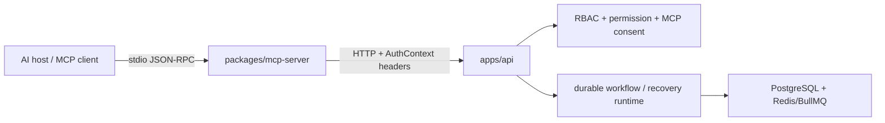

# MCP server: agent-operable Janusly

This document describes the server direction of the Model Context Protocol
integration: an external AI host controlling Janusly through
`packages/mcp-server`. For the opposite direction—Janusly consuming external
MCP servers from an `mcp_tool` workflow node—see
[`mcp-client.md`](mcp-client.md).

## Product boundary

The supported goal is **agent-complete workflow operation**, not unrestricted
agent administration.

An MCP-aware agent can:

1. discover recipes, built-in tools, workflows, and registered outbound MCP
   tools;
2. generate or author a workflow DAG;
3. validate structure and production readiness;
4. save and roll back versions when MCP writes are enabled;
5. start, poll, inspect, resume, cancel, and redrive runs onto a saved patch;
6. inspect run usage, workflow health, recovery metrics, the recovery ledger,
   attributable wins, and durable semantic recovery cases;
7. explain failures, request a candidate patch, resolve a deterministic
   semantic case, replay an exact dead letter on its original snapshot, and
   manually clear a recovery-circuit pause;
8. create, update, rediscover, configure, and delete outbound MCP connections.

That is enough for an agent to use the workflow product end to end while the
durable runtime remains the source of truth. MCP does not replace BullMQ,
PostgreSQL state, retries, approvals, recovery claims, or audit logs. It is a
protocol adapter over those capabilities.

The server deliberately does **not** expose credential values, identity and
membership administration, arbitrary organization configuration, deployment
rollout control, or workflow trash/delete/restore controls. Those remain
operator-owned control-plane actions. Eventual retention purge remains an
internal maintenance operation. A broad "expose every API route" generator
would weaken the permission, consent, and audit review attached to each MCP
tool.

## Architecture



The MCP process never imports Drizzle and never queries PostgreSQL. Every call
goes through the HTTP API, so tenant scope, stable `/v1` validation, permissions,
rate limits, and audit attribution stay in one chokepoint.

`@janusly/shared/src/api-contract` and `@janusly/shared/src/status` are the
server's canonical route/status catalogs. Do not reintroduce duplicated stable
paths or run-status enums in the dispatcher.

## Protocol contract

The current server uses the stable local `stdio` transport and advertises the
MCP `tools` capability. It publishes:

- **26 always-visible tools** for discovery, validation, AI suggestions,
  observation, and recovery evidence;
- **14 write tools** only when `JANUSLY_MCP_WRITES_ENABLED=true`.

Every descriptor has:

- a closed top-level JSON Schema (`additionalProperties: false`);
- an `outputSchema` with one `result` field;
- risk hints (`readOnlyHint`, `destructiveHint`, `idempotentHint`, and
  `openWorldHint`);
- a concise description of the durable follow-up operation.

Always-visible does not imply side-effect-free. `ai.generate_workflow`,
`ai.patch_workflow`, and `reports.run_explain` create bounded audit/usage
evidence (and AI calls consume budget), so they advertise
`readOnlyHint: false` and `idempotentHint: false` even though they do not save a
workflow version and are not hidden behind MCP write consent.

Every successful call returns both:

```json
{
  "content": [{ "type": "text", "text": "{ ... }" }],
  "structuredContent": { "result": {} }
}
```

The text block keeps compatibility with hosts that do not consume structured
results. `structuredContent` gives capable hosts a machine-readable value.
Stable API transport envelopes (`apiVersion`, `requestId`, `data`) are validated
and removed before returning the operation result.

Expected input and API failures return a normal tool result with
`isError: true`; they do not escape as JSON-RPC `-32603` errors. Stable API
errors preserve their code, HTTP status, request ID, and bounded public params
so an agent can correct consent, validation, conflict, or not-found failures.

The initialization response includes instructions for the safe lifecycle:
discover → author → validate/readiness → save → start → poll → inspect/recover.
After saving a candidate patch, `runs.redrive` continues the failed run on that
saved version. `dlq.replay` is reserved for transient or same-version retries
because it keeps the original run snapshot.

Semantic recovery follows a separate evidence-first sequence:
`recovery.cases.list` → `recovery.cases.get` →
`recovery.cases.resolve`. Resolution never trusts an agent assertion: a
replacement output is re-evaluated against the immutable workflow contract,
and the API only resumes downstream work after every open quarantine for the
run is closed. The resolve route passes `guardMcpWrite` before reading the body
and remains destructive/open-world in MCP risk annotations because a valid
decision can release downstream effects.

## Asynchronous runs instead of MCP Tasks

Janusly run IDs are already durable asynchronous handles:

1. `runs.start` returns `runId`;
2. `runs.status` polls current state;
3. `runs.get` walks paginated event history;
4. `runs.resume` continues a waiting human boundary;
5. `runs.redrive` continues a failed saved-workflow run on a selected version;
6. `runs.cancel` requests terminal cancellation.

The MCP 2025-11-25 Tasks utility is still experimental. Duplicating run state
into an experimental protocol task store would create two lifecycle authorities.
Keep task support disabled until the utility is stable and there is a concrete
host interoperability need. If adopted later, an MCP task must be a projection
of one Janusly `runId`, never an independent execution record.

## Why tools-only is adequate now

MCP resources and prompts are useful protocol primitives, but they are not
required for agent-complete workflow control:

- dynamic workflow/run state already has bounded typed tools with tenant-aware
  authorization;
- the server's initialization instructions provide the reusable operating
  sequence;
- adding duplicate resource URIs or prompt templates would create a second
  contract surface without unlocking a missing workflow action.

Revisit resources when hosts need subscribable read-only run/workflow context.
Revisit prompts when multiple hosts demonstrate that initialization
instructions are not sufficiently discoverable. Do not add either capability by
only changing the advertised flag; each needs handlers, authorization tests,
pagination semantics, and documentation.

## Transport and authentication boundary

`stdio` is intentionally the only inbound server transport today. The MCP host
starts the process and supplies:

- `JANUSLY_API_URL`
- `JANUSLY_API_ORG_ID`
- `JANUSLY_API_USER_ID`
- optional `JANUSLY_API_SERVICE_TOKEN`

A remote Streamable HTTP server is a separate deployment feature, not a
transport toggle. It requires OAuth 2.1 protected-resource metadata, resource
audience binding, session/origin defenses, and production deployment evidence
before it can be advertised safely. Stdio continues to use environment-provided
credentials, as recommended by the MCP authorization specification.

## Write safety

Write tools pass four independent layers:

1. the MCP server advertises and dispatches them only when
   `JANUSLY_MCP_WRITES_ENABLED=true`;
2. the API calls `guardMcpWrite(auth, actionKey)`;
3. the tenant must enable `org_configs.mcp.writeConsent`;
4. normal route role and permission checks still apply.

Accepted calls use the normal API audit chokepoint and are attributed with
`source: "mcp"`. Connection management additionally requires admin RBAC.
`runs.cancel` and `mcp.connections.delete` are marked destructive.
`runs.redrive` is idempotence-hinted because the runtime returns the same
continuation for one source-node/target-version pair. `workflows.resume` is not:
when its result reports buffered events remaining, another call drains another
bounded page. Starting, resuming, redriving, replaying, and connection
operations are marked open-world because they can cause or configure
interactions outside Janusly.

Never add a write tool unless its backing route has:

- a stable request/response contract;
- `guardMcpWrite` at the route chokepoint;
- role and permission metadata;
- bounded request validation;
- audit attribution;
- env-off, env-on, API-error, and protocol-smoke tests.

## Pagination and bounded reads

`workflows.list` and `runs.list` expose all filters from their stable contracts.
Both APIs currently return arrays rather than a page envelope. To fetch the next
page, derive `before` as `<createdAt>|<id>` from the final row. `runs.get`
returns `eventsCursor` and `eventsHasMore` directly for event pagination.

Invalid MCP arguments fail locally. They are never silently dropped, because
dropping an invalid filter could broaden a tenant query.

## Verification

The package test suite must prove:

- read/write catalog visibility and every risk annotation;
- exact stable route/query/body translation;
- primitive JSON run and resume inputs;
- strict rejection of invalid or query-broadening arguments;
- structured success and structured `isError` results;
- a real SDK smoke over stdio, including one loopback HTTP API proxy call.

Run:

```bash
pnpm --filter @janusly/mcp-server test
pnpm --filter @janusly/mcp-server build
```

The protocol smoke opens a loopback listener and may need to run outside a
listener-restricted sandbox.

## References

- [MCP architecture](https://modelcontextprotocol.io/docs/learn/architecture)
- [MCP tools](https://modelcontextprotocol.io/specification/2025-11-25/server/tools)
- [MCP authorization](https://modelcontextprotocol.io/specification/2025-11-25/basic/authorization)
- [MCP Tasks utility](https://modelcontextprotocol.io/specification/2025-11-25/basic/utilities/tasks)
