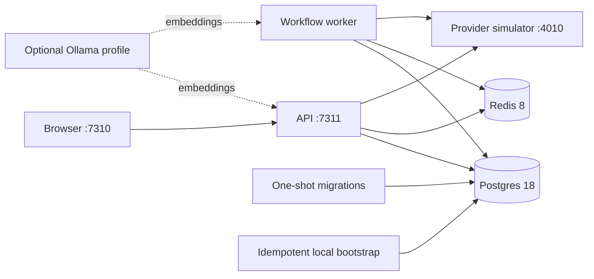

# Persistent Local Deployment

Janusly includes a production-shaped, loopback-only Docker stack for private
evaluation before any public deployment. It keeps real Postgres, Redis,
API/worker separation, provider failure semantics, and durable recovery
evidence while replacing public provider calls with an explicit local
simulator.

This profile is a **local integration lab**, not an internet-facing production
configuration. It enables development authentication and private HTTP targets
so containers can reach the bundled simulator.

## Topology



The API and worker stay separate intentionally. The API owns request handling,
authorization, ingestion, and live reads; the worker owns queued execution and
maintenance jobs. Keeping both processes in the lab catches queue, restart,
and concurrency failures that an all-in-one process would hide.

## Start And Verify

Requirements are Node.js 24, pnpm 11, and Docker with Compose v2.

```bash
corepack enable
pnpm install
pnpm local:up
```

The first command copies `deploy/local/local.env.example` to the ignored
`deploy/local/local.env`. Edit that file for host-port or local sender changes.
Then open <http://127.0.0.1:7310>; development auth uses organization `default`
and user `dev-user`.

The uncommon host ports `7310` (web) and `7311` (API) are deliberate so the
lab does not compete with projects that commonly use `3000` and `3001`. The
containers still listen internally on `3000` and `3001`; only the loopback host
mappings change. Override `JANUSLY_LOCAL_WEB_PORT`, `JANUSLY_LOCAL_API_PORT`,
`JANUSLY_LOCAL_API_URL`, and `JANUSLY_LOCAL_WEB_ORIGINS` together when another
host range is preferred.

Run the qualification gates while the stack is healthy:

```bash
pnpm local:smoke          # real inbound event and four successful provider effects
pnpm local:failure-smoke  # controlled Slack outage, fail-closed run, open DLQ evidence
pnpm local:ui-smoke       # Chromium smoke plus screenshots
pnpm local:verify         # success smoke, full service restart, persistence check
```

`local:smoke` submits the same inbound event twice and requires both deliveries
to converge on one run. `local:verify` additionally restarts Postgres, Redis,
the simulator, API, worker, and web, then reads the original workflow and run
again. No public GitHub, Slack, webhook, or email endpoint is contacted.

## Lifecycle And Persistence

```bash
pnpm local:status
pnpm local:logs
pnpm local:restart
pnpm local:down   # stop containers; preserve named volumes
pnpm local:up     # resume with the same workflows, runs, DLQ, and request log
pnpm local:reset  # destructive: remove all local-stack volumes
```

The Compose project owns four named volumes:

| Volume | Contents |
| --- | --- |
| `postgres_data` | Workflows, versions, runs, events, DLQ, audit, tenant config |
| `redis_data` | BullMQ state, delayed work, and Redis append-only persistence |
| `provider_data` | Bounded simulator request evidence and provider modes |
| `ollama_models` | Optional downloaded embedding models |

`local:down` is the normal stop command. Use `local:reset` only when a clean,
destructive test environment is intended.

## Provider Simulator

The simulator listens on the loopback port selected by
`JANUSLY_LOCAL_SIMULATOR_PORT` (4010 by default). It records at most the latest
200 requests returned by `GET /requests` and supports `github`, `slack`,
`webhook`, and `email` providers.

Each provider has one of three deterministic modes:

```bash
curl -X POST http://127.0.0.1:4010/control \
  -H 'content-type: application/json' \
  -d '{"provider":"slack","mode":"failure"}'

curl -X POST http://127.0.0.1:4010/control \
  -H 'content-type: application/json' \
  -d '{"provider":"slack","mode":"success"}'
```

- `success` returns the contract Janusly expects.
- `failure` returns a provider-shaped HTTP 503.
- `malformed` returns a successful HTTP status with an invalid response shape.

Provider state and request evidence survive container restarts. Delete only the
request log with `DELETE /requests`, or use `pnpm local:reset` to remove all
simulator state.

Simulator routing is guarded by both
`JANUSLY_LOCAL_INTEGRATION_SIMULATOR=true` and a process-owned simulator URL.
It does not rewrite arbitrary outbound destinations: only the bundled GitHub
and Slack credentials, the local mailer, and RFC-reserved `*.example.com`
webhook placeholders can be redirected.

## Optional AI And Memory

With no `ANTHROPIC_API_KEY`, Janusly exercises deterministic AI fallbacks at
zero provider cost. Add a key only to `deploy/local/local.env` when real
Anthropic completion behavior is deliberately under test.

Ollama is optional and disabled by default:

```bash
docker compose --env-file deploy/local/local.env \
  -f deploy/local/compose.yml --profile memory up -d ollama
```

Set `JANUSLY_MEMORY_ENABLED=true` in `local.env`, restart API and worker, then
enable `memory.enabled` and explicit `memory.allowedKinds` through the tenant
configuration API. Starting Ollama alone never enables persistent memory.

## Safety Boundaries

- Every published port binds to `127.0.0.1`.
- The generated `local.env` is ignored by Git.
- Images run as non-root users.
- GitHub, Slack, webhook, and email simulation is opt-in and process-gated.
- `ALLOW_PRIVATE_HTTP_TARGETS=true` and development auth are acceptable only
  inside this loopback lab; do not copy them into a public deployment.
- Real credentials still belong in environment variables or a vault, never in
  workflow JSON or tenant configuration.

For the short-lived development/test orchestrator use `pnpm dev`. For metrics,
traces, dashboards, and alerts, see [Observability](observability.md).
