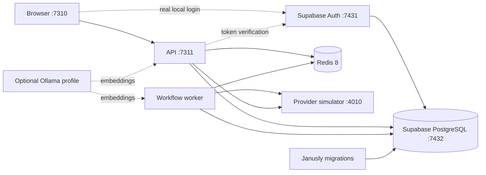

# Persistent Local Deployment

Janusly includes a production-shaped Docker stack for private evaluation
before any public deployment. It keeps real Postgres, Redis,
API/worker separation, provider failure semantics, and durable recovery
evidence while replacing public provider calls with an explicit local
simulator.

This profile is a **local integration lab**, not an internet-facing production
configuration. Supabase CLI owns the single PostgreSQL database: Supabase Auth
uses the `auth` schema and Janusly's Drizzle migrations use `public`.

## Topology



There is no second Janusly PostgreSQL container. The database named by
`supabase status -o env` is injected in memory into migration, API, and worker
containers. Supabase-managed objects stay in `auth`; Janusly tables stay in
`public`.

The API and worker stay separate intentionally. The API owns request handling,
authorization, ingestion, and live reads; the worker owns queued execution and
maintenance jobs. Keeping both processes in the lab catches queue, restart,
and concurrency failures that an all-in-one process would hide.

## Start And Verify

Requirements are Node.js 24, pnpm 11, and Docker with Compose v2.

```bash
corepack enable
pnpm install
pnpm local:auth:up
```

The first command copies `deploy/local/local.env.example` to the ignored
`deploy/local/local.env`. Edit that file for host-port or local sender changes.
Then open <http://127.0.0.1:7310>, create the first account, and create the
first organization manually. A clean start has no users, organizations,
workflows, credentials, tenant configuration, or example canvas nodes.

`pnpm local:up` uses the same Supabase PostgreSQL database but keeps
`dev-headers` for automated provider qualification. It also starts without
database fixtures; the synthetic `default` development workspace is an auth
compatibility projection, not a stored organization.

The uncommon host ports `7310` (web) and `7311` (API) are deliberate so the
lab does not compete with projects that commonly use `3000` and `3001`. The
containers still listen internally on `3000` and `3001`; only the loopback host
mappings change. Override `JANUSLY_LOCAL_WEB_PORT`, `JANUSLY_LOCAL_API_PORT`,
`JANUSLY_LOCAL_API_URL`, and `JANUSLY_LOCAL_WEB_ORIGINS` together when another
host range is preferred.

Run the qualification gates while the stack is healthy:

```bash
pnpm local:smoke          # real inbound event and four successful provider effects
pnpm local:failure-smoke  # controlled Slack outage, fail-closed run, open DLQ evidence
pnpm local:ui-smoke       # Chromium smoke plus screenshots
pnpm local:verify         # success smoke, full service restart, persistence check
```

`local:smoke` submits the same inbound event twice and requires both deliveries
to converge on one run. These commands explicitly install their own bounded
provider fixtures; normal startup never does. `local:ui-smoke` also creates its
controlled provider failure before opening Chromium, so it does not rely on
prior database state. `local:verify` additionally restarts Supabase, Redis,
the simulator, API, worker, and web, then reads the original workflow and run
again. No public GitHub, Slack, webhook, or email endpoint is contacted.

## Real Local Identity Profile

Both profiles use Supabase PostgreSQL. The `local:auth:*` family additionally
enables the real product login boundary:

```bash
pnpm local:auth:up
pnpm local:auth:ui-smoke
```

The pinned Supabase CLI stack exposes Auth on host port `7431` and the single
shared PostgreSQL database on `7432`; Janusly web/API remain on loopback ports
`7310`/`7311`. Unlike the Janusly Compose mappings, Supabase CLI can publish
its Docker ports on every host interface. Treat `7431`/`7432` as trusted
workstation ports, protect them with the host firewall, and never expose them
to an untrusted LAN. The orchestrator captures `supabase status -o env`,
injects the database URL into migration/API/worker containers, and passes Auth
keys only to the web build and API. It disables `ALLOW_DEV_AUTH_HEADERS` for
this profile. Generated credentials are never printed or written to a tracked
file.

The browser smoke creates two real email/password identities, creates and
switches organizations, accepts an invitation, verifies viewer/editor action
availability, restarts Supabase plus the Janusly services, signs in again, and
captures persistence screenshots. Email confirmation is disabled only in the
local Supabase config so tests do not depend on SMTP.

```bash
pnpm local:auth:status
pnpm local:auth:restart
pnpm local:db:verify
pnpm local:auth:down    # preserves the unified database
pnpm local:auth:reset   # destructive: removes Auth and Janusly data together
```

Use the `local:auth:*` and ordinary `local:*` lifecycle families consistently
for one run. The ordinary provider smoke commands use dev headers and therefore
intentionally do not run against the real-identity profile.

## Local Development Versus Internal Deployment

The Supabase CLI profile in this repository is development/test infrastructure.
It has no production TLS or network hardening and must not be exposed to an
untrusted network. Supabase CLI may publish `7431`/`7432` on every host
interface even though the Janusly Compose services bind to loopback. Apart
from initial container-image/package downloads, all database and Auth
processing stays on the machine. CLI telemetry is explicitly disabled by the
orchestrator.

An internal or on-premises production installation is possible, but it must
use Supabase's supported self-hosted Docker topology rather than `supabase
start`. That deployment needs TLS/reverse proxying, rotated keys, SMTP,
backups, upgrades, monitoring, connection pooling, and disaster recovery.
External SMTP, OAuth, SMS, AI, or workflow providers naturally send only the
traffic explicitly configured for those integrations.

Supabase's platform repository is Apache-2.0 and the Auth service is MIT
licensed. Self-hosting does not require a managed Supabase subscription, but
the operator pays and owns the infrastructure and operational work. Always
verify the license of every optional component/image kept in a custom
self-hosted topology.

## Lifecycle And Persistence

```bash
pnpm local:status
pnpm local:logs
pnpm local:restart
pnpm local:down   # stop containers; preserve named volumes
pnpm local:up     # resume with the same workflows, runs, DLQ, and request log
pnpm local:reset  # destructive: remove all local-stack volumes
```

Supabase CLI owns the PostgreSQL persistence containing both schemas. The
Compose project owns three additional named volumes:

| Volume | Contents |
| --- | --- |
| Supabase DB storage | `auth` identities plus Janusly `public` tables |
| `redis_data` | BullMQ state, delayed work, and Redis append-only persistence |
| `provider_data` | Bounded simulator request evidence and provider modes |
| `ollama_models` | Optional downloaded embedding models |

`local:down` is the normal stop command. Use `local:reset` only when a clean,
destructive test environment is intended.

Both lifecycle families stop Supabase through its backup-preserving CLI path.
Only `local:reset`/`local:auth:reset` use the destructive no-backup boundary.
`pnpm local:db:verify-empty` proves both `auth` and `public` exist in one
database and that the manual-start tables are empty.

## Provider Simulator

The simulator listens on the loopback port selected by
`JANUSLY_LOCAL_SIMULATOR_PORT` (4010 by default). It records at most the latest
200 requests returned by `GET /requests` and supports `github`, `slack`,
`webhook`, and `email` providers.

Each provider has one of three deterministic modes:

```bash
curl -X POST http://127.0.0.1:4010/control \
  -H 'content-type: application/json' \
  -d '{"provider":"slack","mode":"failure"}'

curl -X POST http://127.0.0.1:4010/control \
  -H 'content-type: application/json' \
  -d '{"provider":"slack","mode":"success"}'
```

- `success` returns the contract Janusly expects.
- `failure` returns a provider-shaped HTTP 503.
- `malformed` returns a successful HTTP status with an invalid response shape.

Provider state and request evidence survive container restarts. Delete only the
request log with `DELETE /requests`, or use `pnpm local:reset` to remove all
simulator state.

Simulator routing is guarded by both
`JANUSLY_LOCAL_INTEGRATION_SIMULATOR=true` and a process-owned simulator URL.
It does not rewrite arbitrary outbound destinations: only the bundled GitHub
and Slack credentials, the local mailer, and RFC-reserved `*.example.com`
webhook placeholders can be redirected.

## Opt-in External Providers

The simulator remains the default because its smoke commands deliberately
create GitHub, Slack, webhook, and email effects. For private real-use testing,
edit the ignored `deploy/local/local.env`:

```dotenv
JANUSLY_LOCAL_INTEGRATION_SIMULATOR=false
GITHUB_TOKEN=github-token-for-a-dedicated-test-repository
SLACK_WEBHOOK_URL=https://hooks.slack.com/services/...
WEBHOOK_SIGNING_SECRET=replace-with-a-local-random-secret

# Optional email delivery. Keep noop when email is not under test.
JANUSLY_MAILER_PROVIDER=noop
# JANUSLY_MAILER_PROVIDER=resend
# RESEND_API_KEY=re_...
```

Then run `pnpm local:auth:up` and create the matching credential records
manually from Connections. Startup never creates or rewrites credentials.
The simulator-only qualification commands use separate explicit fixtures and
refuse to run while external mode is active.

Every additional `NAME=value` entry in this ignored file is available to the
API and worker so a credential row can use `NAME` as its `secretRef`. The file
is not injected into the web or provider-simulator containers, and secret
values are never compiled into the browser image. Confirm presence without
revealing values:

```bash
curl -s http://127.0.0.1:7311/credentials/health \
  -H 'x-org-id: default' \
  -H 'x-user-id: dev-user'
```

Use dedicated test repositories, channels, mail domains, and webhook receivers.
`pnpm local:smoke`, `local:failure-smoke`, `local:verify`, and `local:ui-smoke`
refuse to run while external mode is active so qualification cannot
accidentally create real side effects.

## Optional AI And Memory

With no `ANTHROPIC_API_KEY`, Janusly exercises deterministic AI fallbacks at
zero provider cost. Add a key only to `deploy/local/local.env` when real
Anthropic completion behavior is deliberately under test.

Ollama is optional and disabled by default:

```bash
docker compose --env-file deploy/local/local.env \
  -f deploy/local/compose.yml --profile memory up -d ollama
```

Set `JANUSLY_MEMORY_ENABLED=true` in `local.env`, restart API and worker, then
enable `memory.enabled` and explicit `memory.allowedKinds` through the tenant
configuration API. Starting Ollama alone never enables persistent memory.

## Safety Boundaries

- Janusly Compose services bind published ports to `127.0.0.1`; Supabase CLI
  may publish Auth `7431` and PostgreSQL `7432` on every host interface, so the
  local lab requires a trusted workstation and host firewall.
- The generated `local.env` is ignored by Git.
- Supabase CLI telemetry is disabled by both `SUPABASE_TELEMETRY_DISABLED=1`
  and `DO_NOT_TRACK=1`; the self-hosted containers do not send telemetry.
- Normal startup never inserts example users, organizations, workflows,
  credentials, or tenant configuration.
- Images run as non-root users.
- GitHub, Slack, webhook, and email simulation is opt-in and process-gated.
- External provider delivery requires an explicit simulator opt-out and local
  secret values; no smoke command runs against that mode.
- `ALLOW_PRIVATE_HTTP_TARGETS=true` and default-profile development auth are
  acceptable only inside this loopback lab; the Supabase profile disables dev
  headers. Do not copy either local posture into a public deployment.
- Real credentials still belong in environment variables or a vault, never in
  workflow JSON or tenant configuration.

For the short-lived development/test orchestrator use `pnpm dev`. For metrics,
traces, dashboards, and alerts, see [Observability](observability.md).
