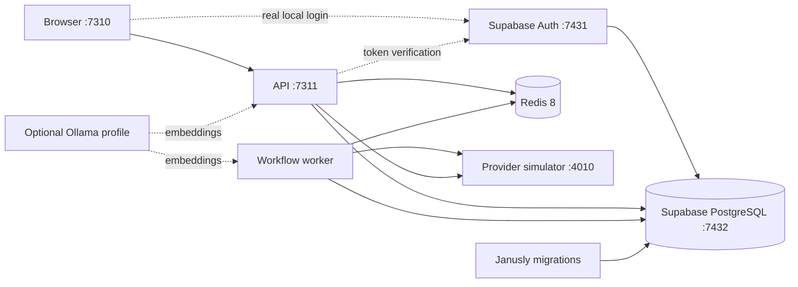

# Persistent Local Deployment

Janusly includes a production-shaped Docker stack for private evaluation
before any public deployment. It keeps real Postgres, Redis,
API/worker separation, provider failure semantics, and durable recovery
evidence while replacing public provider calls with an explicit local
simulator.

This profile is a **local integration lab**, not an internet-facing production
configuration. Supabase CLI owns the single PostgreSQL database: Supabase Auth
uses the `auth` schema and Janusly's Drizzle migrations use `public`.

## Topology



There is no second Janusly PostgreSQL container. The database named by
`supabase status -o env` is injected in memory into migration, API, and worker
containers. Supabase-managed objects stay in `auth`; Janusly tables stay in
`public`.

The API and worker stay separate intentionally. The API owns request handling,
authorization, ingestion, and live reads; the worker owns queued execution and
maintenance jobs. Keeping both processes in the lab catches queue, restart,
and concurrency failures that an all-in-one process would hide.

## Start And Verify

Requirements are Node.js 24, pnpm 11, and Docker with Compose v2.

```bash
npm install --global pnpm@11.17.0
pnpm install
pnpm local:auth:up
```

Janusly does not depend on Node's bundled Corepack. The exact pnpm release
stays pinned in the root `packageManager` field, while local machines install
pnpm directly and CI uses `pnpm/action-setup`.

The `pnpm local:auth:up` command copies `deploy/local/local.env.example` to the ignored
`deploy/local/local.env` and creates an ignored
`deploy/local/.secrets/credential-master.key` with directory mode 0700 and file
mode 0600. The generated environment file is also repaired to mode 0600 on
every lifecycle command because it may contain real provider credentials.
Compose exposes the root key read-only to the non-root API and worker through
its secret mount; it is never
printed, copied into the browser image, or stored in PostgreSQL. Edit
`local.env` for host-port or local sender changes. Then open
<http://127.0.0.1:7310>, create the first account, and create the first
organization manually. A clean start has no users, organizations, workflows,
credentials, tenant configuration, or example canvas nodes.

`pnpm local:up` uses the same Supabase PostgreSQL database but keeps
`dev-headers` for automated provider qualification. It also starts without
database fixtures; the synthetic `default` development workspace is an auth
compatibility projection, not a stored organization.

The uncommon host ports `7310` (web) and `7311` (API) are deliberate so the
lab does not compete with projects that commonly use `3000` and `3001`. The
containers still listen internally on `3000` and `3001`; only the loopback host
mappings change. Override `JANUSLY_LOCAL_WEB_PORT`, `JANUSLY_LOCAL_API_PORT`,
`JANUSLY_LOCAL_API_URL`, and `JANUSLY_LOCAL_WEB_ORIGINS` together when another
host range is preferred.

Run the qualification gates while the stack is healthy:

```bash
pnpm local:smoke          # real inbound event and four successful provider effects
pnpm local:pagerduty-smoke # managed secrets + signed event + acknowledge/snooze
pnpm local:failure-smoke  # controlled Slack outage, fail-closed run, open DLQ evidence
pnpm local:recovery-lab   # provider outage → validated repair → idempotent redrive
pnpm local:ui-smoke       # Chromium smoke plus screenshots
pnpm local:verify         # success smoke, full service restart, persistence check
```

`local:smoke` submits the same inbound event twice and requires both deliveries
to converge on one run. These commands explicitly install their own bounded
provider fixtures; normal startup never does. `local:ui-smoke` also creates its
controlled provider failure and runs the PagerDuty prompt-generated workflow
qualification before opening Chromium. It captures the recovery surface and
the generated PagerDuty graph plus its normal Inspector configuration without
relying on prior database state. `local:verify` additionally restarts Supabase,
Redis, the simulator, API, worker, and web, then reads the original workflow
and run again. `local:pagerduty-smoke` creates managed API/signing credentials,
asks `/ai/generate-workflow` for the off-hours automation, saves that exact
graph, sends a signed event, requires one simulator GET→PUT→POST sequence, and
proves a duplicate delivery creates no second external effect. No public
GitHub, Slack, PagerDuty, webhook, or email endpoint is contacted.

## Clean Installation Qualification

A clean installation deliberately removes the unified Auth/application
database, Redis and simulator volumes, generated local environment file, and
Credential Secret Store root key. It then recreates private configuration,
builds the current checkout, starts real Supabase identity, applies every
Janusly migration, and proves the database has no users or tenant data:

```bash
pnpm local:clean-install -- --confirm-reset
```

The explicit confirmation is mandatory and the command is available only for
the real local identity profile. Back up anything important first.

Run the complete browser qualification with:

```bash
JANUSLY_EVIDENCE_DIR="$PWD/output/review/local-clean-install" \
  pnpm local:clean-install:smoke -- --confirm-reset
```

The smoke requires the empty database, captures the English and Spanish login
and first-workspace onboarding surfaces, checks serious/critical accessibility
findings, horizontal overflow, and browser/network errors, and proves that
sign-up creates only one identity—not an organization, workflow, credential,
or tenant configuration. It resets and starts the stack once more afterward,
leaving a clean login screen ready for manual configuration. Its JSON report
and screenshots stay under the ignored evidence directory.

## Upgrade and Rollback Qualification

Janusly database migrations are forward-only. A safe rollback therefore means
running the previous application generation against the already-upgraded
schema, not deleting schema changes in place. The destructive qualification
automatically selects the application immediately before the newest migration,
proves historical migration files are byte-for-byte unchanged, builds that
source, creates a real identity/workspace/workflow/run, and takes an owner-only
pre-upgrade database snapshot. It then:

1. starts the current checkout and applies only the added migrations;
2. proves the identity and application records remain usable in English and
   Spanish;
3. restarts the retained previous-generation images without rebuilding them;
4. proves that application rollback can still read the upgraded database;
5. rolls forward to the current application and proves the same records are
   usable there again; and
6. resets the qualification data, leaving the current stack empty.

Run it only after backing up local data:

```bash
JANUSLY_EVIDENCE_DIR="$PWD/output/review/local-upgrade-rollback" \
  pnpm local:upgrade-rollback:smoke -- --confirm-reset
```

`JANUSLY_UPGRADE_BASE_REF=<commit>` may override the automatically selected
ancestor. The override must still be an ancestor with a strict, unchanged
prefix of current migrations. Qualification evidence includes the migration
inventories, database states, backup checksum, build-compatibility disclosure,
and bilingual browser screenshots. The report identifies the checked-out HEAD
and records whether qualification used uncommitted source so evidence never
overstates its provenance. Because container tags are mutable unless the source
pins its base, every current Janusly Node container stage uses one exact Node
24.18.0 multi-architecture manifest digest. Temporary historical image tags are
removed after the current stack is restored.

## Real Local Identity Profile

Both profiles use Supabase PostgreSQL. The `local:auth:*` family additionally
enables the real product login boundary:

```bash
pnpm local:auth:up
pnpm local:auth:ui-smoke
```

The pinned Supabase CLI stack exposes Auth on host port `7431` and the single
shared PostgreSQL database on `7432`; Janusly web/API remain on loopback ports
`7310`/`7311`. The orchestrator creates a dedicated Docker bridge whose default
host binding is `127.0.0.1`, inspects the effective container bindings, and
recreates only the published gateway/database containers with an explicit
loopback `HostIp` if the Docker runtime ignored that bridge option. The
recreation uses the local Unix Docker API, keeps the database volume and
container configuration, writes no secret-bearing image or temporary file,
and rolls the original container back if replacement fails. Startup fails
closed if any published Supabase port remains non-loopback.

The orchestrator captures `supabase status -o env`, injects the database URL
into migration/API/worker containers, and passes Auth keys only to the web
build and API. It disables `ALLOW_DEV_AUTH_HEADERS` for this profile. Generated
credentials are never printed or written to a tracked file.

The browser smoke creates two real email/password identities, creates and
switches organizations, accepts an invitation, verifies viewer/editor action
availability, restarts Supabase plus the Janusly services, signs in again, and
captures persistence screenshots. Email confirmation is disabled only in the
local Supabase config so tests do not depend on SMTP.

```bash
pnpm local:auth:status
pnpm local:auth:restart
pnpm local:db:verify
pnpm local:auth:down    # preserves the unified database
pnpm local:auth:reset   # destructive: removes Auth and Janusly data together
```

Use the `local:auth:*` and ordinary `local:*` lifecycle families consistently
for one run. The ordinary provider smoke commands use dev headers and therefore
intentionally do not run against the real-identity profile.

## Local Development Versus Internal Deployment

The Supabase CLI profile in this repository is development/test infrastructure.
It has no production TLS, rate limiting, or production key lifecycle and must
not be exposed publicly. The local orchestrator restricts every published
service to loopback and verifies the effective bindings rather than trusting
Docker network defaults. Apart from initial container-image/package downloads,
all database and Auth processing stays on the machine. CLI telemetry is
explicitly disabled by the orchestrator.

An internal or on-premises production installation is possible, but it must
use Supabase's supported self-hosted Docker topology rather than `supabase
start`. That deployment needs TLS/reverse proxying, rotated keys, SMTP,
backups, upgrades, monitoring, connection pooling, and disaster recovery.
External SMTP, OAuth, SMS, AI, or workflow providers naturally send only the
traffic explicitly configured for those integrations.

Supabase's platform repository is Apache-2.0 and the Auth service is MIT
licensed. Self-hosting does not require a managed Supabase subscription, but
the operator pays and owns the infrastructure and operational work. Always
verify the license of every optional component/image kept in a custom
self-hosted topology.

## Lifecycle And Persistence

```bash
pnpm local:status
pnpm local:logs
pnpm local:restart
pnpm local:down   # stop containers; preserve named volumes
pnpm local:up     # resume with the same workflows, runs, DLQ, and request log
pnpm local:reset  # destructive: remove all local-stack volumes
```

`local:status` and `local:auth:status` remain safe to run while the stack is
stopped. They show the Compose service table plus a bounded
`Supabase unavailable` summary rather than failing or printing captured CLI
credentials.

Supabase CLI owns the PostgreSQL persistence containing both schemas. The
Compose project owns three additional named volumes:

| Volume | Contents |
| --- | --- |
| Supabase DB storage | `auth` identities plus Janusly `public` tables |
| `redis_data` | BullMQ state, delayed work, and Redis append-only persistence |
| `provider_data` | Bounded simulator request evidence and provider modes |
| `ollama_models` | Optional downloaded embedding models |

`local:down` is the normal stop command. Use `local:reset` only when a clean,
destructive test environment is intended.

Both lifecycle families stop Supabase through its backup-preserving CLI path.
Only `local:reset`/`local:auth:reset` use the destructive no-backup boundary.
`pnpm local:db:verify-empty` proves both `auth` and `public` exist in one
database and that the manual-start tables are empty.

### Portable backup and restore

A Compose restart or normal stop proves persistence on one workstation, but it
is not a portable backup. Create a logical snapshot of both application and
identity data with:

```bash
pnpm local:backup
# or choose a private destination explicitly
pnpm local:backup -- /path/to/private/janusly-backup
```

The command briefly quiesces the web, API, worker, and Supabase Auth gateway so
the snapshot is consistent. It writes an ignored `output/backups/...`
directory by default containing:

- `database.sql`: a data-only dump of the `auth` and `public` schemas;
- `credential-master.key`: the matching root key required to decrypt managed
  credentials;
- `manifest.json`: format, migration fingerprint, checksums, source commit, and
  bounded row counts used for restore verification. It also records any legacy
  `public` tables no longer declared by Janusly; those tables are excluded from
  the restorable dump instead of making a clean current schema impossible to
  restore. Supabase Auth's own `auth.schema_migrations` ledger is also excluded:
  the freshly started, pinned Auth image owns that schema history, while the
  backup restores its user, identity, factor, and session data.

The directory and files are owner-only, but the backup is **not encrypted**.
It contains password hashes, sessions, workflow data, and the credential root
key. Store it in an encrypted disk or secret-aware backup system and never
commit or share it.

Restore only into the same migration set:

```bash
pnpm local:restore -- /path/to/private/janusly-backup --confirm-reset
```

Restore validates the manifest, both SHA-256 checksums, and the current
migration fingerprint before crossing the destructive boundary. It then resets
the unified local database, restores the exact credential key, recreates the
current schema, loads the snapshot, and requires the bounded row counts to
match before restarting the application and Auth services. The explicit
`--confirm-reset` flag is mandatory because all current local Auth and Janusly
data are replaced.

Redis and provider-simulator volumes are intentionally not part of this
portable snapshot. PostgreSQL is the durable source of workflow, run,
outbox/reconciliation, and schedule state; a restore starts with a fresh queue
and the worker rebuilds durable publications and schedulers. Provider simulator
request history is qualification evidence rather than product data.

## Provider Simulator

The simulator listens on the loopback port selected by
`JANUSLY_LOCAL_SIMULATOR_PORT` (4010 by default). It records at most the latest
200 requests returned by `GET /requests` and supports `github`, `slack`,
`webhook`, `email`, and `pagerduty` providers.

Each provider has one of three deterministic modes:

```bash
curl -X POST http://127.0.0.1:4010/control \
  -H 'content-type: application/json' \
  -d '{"provider":"slack","mode":"failure"}'

curl -X POST http://127.0.0.1:4010/control \
  -H 'content-type: application/json' \
  -d '{"provider":"slack","mode":"success"}'
```

- `success` returns the contract Janusly expects.
- `failure` returns a provider-shaped HTTP 503.
- `malformed` returns a successful HTTP status with an invalid response shape.

Provider state, request evidence, and the webhook effect ledger survive
container restarts. Delete request evidence with `DELETE /requests`, webhook
effects with `DELETE /effects`, or use `pnpm local:reset` to remove all
simulator state.

Simulator routing is guarded by both
`JANUSLY_LOCAL_INTEGRATION_SIMULATOR=true` and a process-owned simulator URL.
It does not rewrite arbitrary outbound destinations: only the bundled GitHub
and Slack credentials, the local mailer, and RFC-reserved `*.example.com`
webhook placeholders can be redirected. PagerDuty integration tools switch to
the simulator's `/pagerduty` API only under the same explicit process gate.

### Real Recovery Lab

The Recovery Lab is an explicit, removable proof of the complete recovery
path. It uses a dedicated `local-recovery-lab` organization, creates one
payment-retry workflow through the normal API, and then:

1. sends a schema-valid AI result through the Anthropic messages SDK transport
   to the loopback provider simulator;
2. fails the operator-authored business expression, creates a durable semantic
   case, quarantines the run, and proves the downstream effect did not execute;
3. validates an operator replacement with the same deterministic detector and
   resumes the original run;
4. injects a webhook-provider outage after the human approval and reaches the
   real DLQ through the normal worker path;
5. validates a bounded timeout repair against the provider simulator and
   persists a validation-scoped provider receipt;
6. saves the repaired workflow, redrives the original failed run, and verifies
   both the semantic outcome and generation-bound recovery ledger;
7. repeats the same invoice delivery and proves the provider effect was not
   applied twice.

```bash
pnpm local:up
pnpm local:recovery-lab

JANUSLY_EVIDENCE_DIR="$PWD/output/review/real-recovery-lab" \
  pnpm local:recovery-lab:ui-smoke

pnpm local:recovery-lab:destroy
```

The UI smoke writes a machine-readable `recovery-lab.json` bundle plus English
and Spanish application screenshots under `output/review/` by default. The
bundle distinguishes the simulated Anthropic request, deterministic semantic
case/replacement, provider validation receipt, production effect ledger, and
duplicate-delivery result. The create command cleans only the
dedicated Lab organization before recreating it; the destroy command removes
that organization and its simulator request/effect evidence. Both commands
refuse an organization id that does not begin with `local-recovery-lab`.
After qualification (including a failed attempt), the script recreates the
ordinary local API/worker profile so later manual runs cannot inherit the
temporary Anthropic simulator endpoint.

Provider simulation is deliberately narrower than an ordinary sandbox. The
Anthropic-compatible path is enabled only by the Lab process, requires both
local-stack simulator gates, sets `providerSimulated=true`, and records
`costUsd=0`; this qualifies Janusly's SDK/wire integration without claiming a
live vendor call. No LLM output resolves a semantic incident or authorizes a
mutation. For downstream effect simulation, the exact failing-node/descendant
path must include a direct idempotent
`webhook.send` to an RFC-reserved `*.example.com` target and use
`resultPolicy="require_ok"`. Dynamic agent/MCP/subworkflow paths and write-side
HTTP nodes remain effect-free validation. The API and worker independently
re-check the local-stack gates, and a validation run is not promoted to
`provider_simulated` without a valid validation-scoped receipt.

### PagerDuty local qualification

For automated validation, use the dev-header profile:

```bash
pnpm local:up
pnpm local:pagerduty-smoke
```

The command leaves a normal saved workflow, run history, and provider evidence.
It deliberately does not call an LLM, contact a public provider, or seed data
during startup.

For manual testing with real local login, run `pnpm local:auth:up`, create two
managed credentials in Connections:

- API token: kind `pagerduty_api_token`
- Webhook signing secret: kind `pagerduty_webhook_secret`

Then open AI Studio and use a prompt such as:

```text
When PagerDuty alerts user PLOCALUSER outside working hours 09:00 to 17:00
in America/Bogota, acknowledge it and snooze it for 12 hours. Use API
credential pagerduty-api and webhook credential pagerduty-webhook for
operator@example.com.
```

Review the generated graph in Step setup, save it, select the
`pagerduty_incident` node, and copy its callback URL from the normal Inspector
into PagerDuty. The bundled simulator uses `PLOCALUSER` and
`PLOCALSERVICE`. The automated smoke demonstrates the exact signed-payload
contract without exposing the signing value.

## Opt-in External Providers

The simulator remains the default because its smoke commands deliberately
create GitHub, Slack, PagerDuty, webhook, and email effects. For private
real-use testing, edit the ignored `deploy/local/local.env`:

```dotenv
JANUSLY_LOCAL_INTEGRATION_SIMULATOR=false

# Optional email delivery. Keep noop when email is not under test.
JANUSLY_MAILER_PROVIDER=noop
# JANUSLY_MAILER_PROVIDER=resend
# RESEND_API_KEY=re_...
```

Then run `pnpm local:auth:up` and create managed credential values manually
from Connections. This is the recommended path for GitHub, Slack, PagerDuty,
outbound webhooks, and external PostgreSQL credentials. Startup never creates
or rewrites credentials.
The simulator-only qualification commands use separate explicit fixtures and
refuse to run while external mode is active.

Legacy environment-backed credentials remain available when migration or an
external vault injector requires them: every additional `NAME=value` entry in
this ignored file is available to API and worker, and the credential form can
store `NAME` as a legacy reference. The file is not injected into the web or
provider-simulator containers. Confirm managed or legacy presence without
revealing values:

```bash
curl -s http://127.0.0.1:7311/credentials/health \
  -H 'x-org-id: default' \
  -H 'x-user-id: dev-user'
```

Use dedicated test repositories, channels, mail domains, and webhook receivers.
`pnpm local:smoke`, `local:failure-smoke`, `local:verify`, and `local:ui-smoke`
refuse to run while external mode is active so qualification cannot
accidentally create real side effects.

## Optional AI And Memory

With no `ANTHROPIC_API_KEY`, Janusly exercises deterministic AI fallbacks at
zero provider cost. Add a key only to `deploy/local/local.env` when real
Anthropic completion behavior is deliberately under test.

Ollama is optional and disabled by default:

```bash
docker compose --env-file deploy/local/local.env \
  -f deploy/local/compose.yml --profile memory up -d ollama
```

Set `JANUSLY_MEMORY_ENABLED=true` in `local.env`, restart API and worker, then
enable `memory.enabled` and explicit `memory.allowedKinds` through the tenant
configuration API. Starting Ollama alone never enables persistent memory.

## Safety Boundaries

- Janusly Compose services and the Supabase Auth/PostgreSQL containers bind
  every published port to `127.0.0.1`; startup verifies the effective Docker
  mappings and fails closed on a wildcard or non-loopback binding.
- The generated `local.env` is ignored by Git.
- The generated Credential Secret Store root key is ignored by Git and mounted
  read-only into API and worker. Back it up before relying on managed local
  credentials; replacing it makes existing ciphertext unreadable.
- Supabase CLI telemetry is disabled by both `SUPABASE_TELEMETRY_DISABLED=1`
  and `DO_NOT_TRACK=1`; the self-hosted containers do not send telemetry.
- Normal startup never inserts example users, organizations, workflows,
  credentials, or tenant configuration.
- Images run as non-root users.
- GitHub, Slack, PagerDuty, webhook, and email simulation is opt-in and process-gated.
- External provider delivery requires an explicit simulator opt-out and local
  secret values; no smoke command runs against that mode.
- `ALLOW_PRIVATE_HTTP_TARGETS=true` and default-profile development auth are
  acceptable only inside this loopback lab; the Supabase profile disables dev
  headers. Do not copy either local posture into a public deployment.
- Real tenant integration credentials belong in Janusly's encrypted Credential
  Secret Store (recommended) or a deliberately configured external
  environment/vault reference, never in workflow JSON or tenant configuration.

Run the destructive local security qualification against an expendable local
database:

```bash
pnpm local:security:smoke --confirm-reset
```

It resets tenant/Auth data, rebuilds the current checkout, verifies real Auth
rejections, CORS, loopback-only publishing, bounded public health, encrypted
credential storage, server-only secret mounts, bilingual accessibility, and
browser/runtime errors. It then removes the generated tenant/Auth data and
stops the stack; cleanup remains mandatory when a qualification step fails.
Evidence is written under
`output/review/2026-07-30-security-qualification/` and contains no plaintext
credential.

Run the destructive real-identity tenant-isolation qualification:

```bash
pnpm local:tenant-isolation:smoke --confirm-reset
```

It creates two temporary Supabase identities and two organizations, then
qualifies list reads, direct identifiers, mutations, membership authority,
organization switching, permission-aware UI, and independent PostgreSQL row
bindings. The viewer receives one organization grant while the owner switches
between both. Evidence is written under
`output/review/2026-07-30-tenant-isolation-qualification/`. The qualifier
always removes generated Auth/tenant data and stops the stack before it
returns.

Run the destructive local load/soak qualification:

```bash
pnpm local:load-soak:smoke --confirm-reset
```

The default profile admits 200 runs with concurrency 20, then sustains four
runs per second for 45 seconds through a six-node fan-out/fan-in workflow.
It requires unique successful runs, exact PostgreSQL run/node counts, visible
queue pressure, a complete workflow/maintenance drain, no dead letters or
pending publication repairs, healthy metrics, and bilingual browser evidence.
The recorded p50/p95/p99 values are a local-machine baseline, not a production
capacity claim. Tune bounded local experiments with
`JANUSLY_LOAD_BURST_RUNS`, `JANUSLY_LOAD_BURST_CONCURRENCY`,
`JANUSLY_SOAK_SECONDS`, and `JANUSLY_SOAK_RPS`. Evidence is written under
`output/review/2026-07-30-load-soak-qualification/`; generated workload data
is removed and the stack is stopped on success or failure.

For the short-lived development/test orchestrator use `pnpm dev`. For metrics,
traces, dashboards, and alerts, see [Observability](observability.md).
