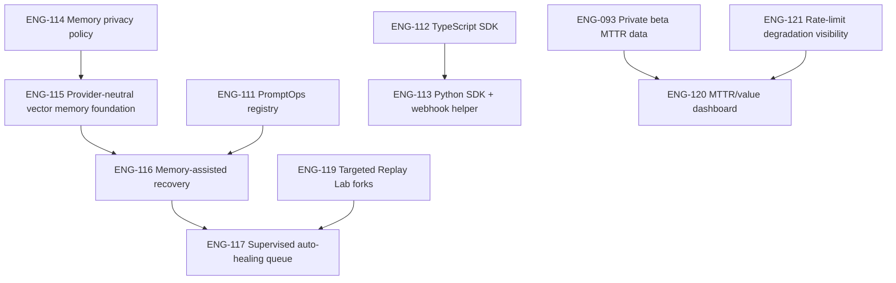

# Product Improvement Plan - May 20, 2026

> Status: curated planning input for `docs/ROADMAP.md`, not an implementation spec.
> Canonical active ticket status lives in `docs/ROADMAP.md` §3b; shipped history lives in §3c.

## Why This Exists

The original research draft contained useful product direction, but it reused
live ticket IDs (`ENG-102` through `ENG-110`) and mixed future vision with code
that does not match Janusly's current architecture. This document keeps the
valuable gaps, removes contradictions, and maps the work to new roadmap IDs
starting at `ENG-111`.

Janusly's direction stays unchanged: become the AI workflow operator teams trust
for critical business processes. The next product layer should strengthen the
same loop already present in the README and PLAN:

1. Observe every run.
2. Explain every failure.
3. Recover safely.
4. Improve over time.

## Research Triage

### Keep

- **PromptOps.** Reusable, versioned prompts are a real gap. They reduce DAG
  churn and make prompt changes testable without forcing every workflow edit to
  become a full graph version change.
- **SDKs.** Distribution is thin. A typed TypeScript SDK, then Python and
  webhook helpers, make Janusly easier to embed into customer apps.
- **Vector memory / embeddings.** Cross-run memory is a core self-learning
  capability. Embeddings are in-scope, but only after the privacy policy lands,
  and only through a provider-neutral, tenant-scoped, opt-in implementation.
- **Supervised auto-healing.** The idea is valuable only if the operator stays
  in control by default. Auto-apply is a later, gated mode after sandbox
  validation, audit, budget checks, and kill switches exist.
- **MCP stdio process hardening.** The existing MCP client already strips the
  spawn environment and enforces command allowlists. The remaining useful gap is
  resource isolation for stdio subprocesses, not a blanket Docker wrapper for
  every transport.
- **ROI / value dashboard.** Useful as a value narrative, but only if it labels
  estimated savings clearly and ties them to MTTR and usage data, not fabricated
  financial certainty.
- **Targeted Replay Lab forks.** Replay Lab already exists as a full-run sandbox
  replay. The useful next step is selected-node forks with operator-provided
  overrides and per-node comparison.

### Modify

- **"Auto-healing autonomous operator" becomes "supervised auto-healing queue."**
  Janusly can recommend and validate fixes automatically; production mutation
  remains operator-approved unless explicit org and process flags enable a
  narrow auto-apply mode.
- **"Semantic memory pgvector" becomes a privacy-gated memory layer.** The
  implementation should use the existing provider-neutral AI package for
  embeddings and should not hardcode OpenAI model dimensions into the schema.
  The rejected part is the vendor assumption, not embeddings.
- **"Dockerized MCP sandbox" becomes stdio-only hardening.** URL transports
  (`sse` / `http`) are governed by outbound HTTP policy and SDK limits; stdio
  subprocesses need CPU, memory, cwd, filesystem, and log-redaction hardening.
- **"Financial ROI dashboard" becomes an MTTR/value dashboard.** Show hard
  numbers from `usage_events`, `dead_letters`, `run_events`, and recovery
  metrics. Show dollar savings only as configurable estimates.

### Reject

- **Reusing `ENG-102` to `ENG-110`.** Those IDs already exist in the live
  roadmap. New work starts at `ENG-111`.
- **Express middleware examples.** Janusly's API is plain Node HTTP with the
  route registry in `apps/api/src/routes.ts`, not Express.
- **`reactflow` imports.** The web app uses `@xyflow/react`.
- **Inline color hex in implementation guidance.** The design system uses
  CSS-first Tailwind 4 tokens from `apps/web/src/index.css`; no inline hex.
- **Rate limiter fail-closed fallback.** AGENTS.md explicitly documents
  Redis-backed rate limiting as fail-open on Redis blips. Cost protection
  belongs in AI budgets, per-org limits, and degradation visibility, not a
  hidden fail-closed change that can take AI Studio down during Redis outages.
- **OpenAI-specific embedding assumptions.** This rejects hardcoded OpenAI
  embedding model, dimension, and storage assumptions. It does not reject
  embeddings as a product capability.
- **Unsupervised production mutation.** Janusly is not "agents that do
  everything"; human approval gates and auditability remain product anchors.

## Clarified Technical Decisions

### Embeddings

Embeddings should stay in the plan. The risky version was storing customer run
data before Janusly has an explicit memory policy, and baking one provider's
embedding shape into the schema. The safe version is ENG-114 first, then
ENG-115 with org opt-in, retention/deletion/export semantics, content scrubbing,
provider/model metadata, and `orgId` filtering before similarity ranking.

Embedding failures should degrade to empty recall with a warning signal. They
must not break recovery, workflow execution, or deterministic AI fallback.

### Auto-Mutation

Auto-mutation is not discarded; it is demoted from default behavior to a gated
mode of supervised auto-healing. The default product should diagnose, propose,
validate in Replay Lab / sandbox mode, and ask an operator to approve. That
matches Janusly's core promise: safe recovery for critical workflows, not
unchecked agents editing production state.

Auto-apply can become a later mode only when both process-wide and tenant flags
are enabled, sandbox validation succeeds, the failure signature is unchanged,
budget/rate checks pass, write-side tools stay skipped in validation, loop
breakers are active, and every decision is audited.

### Fail-Closed Rate Limiting

Fail-closed is rejected for the Redis rate limiter itself. Janusly's operational
posture is fail-open on Redis blips because a temporary limiter outage should
not take AI Studio or workflow operations down. Cost control belongs in AI
budgets, tenant limits, and explicit quota responses; those can fail closed
when a budget is truly exceeded. That is different from failing closed because
Redis is unavailable.

ENG-121 keeps the fail-open runtime behavior and adds the missing operational
visibility: degraded health, structured warnings, and admin copy that separates
"traffic allowed under degraded limiter" from "AI budget exceeded."

## New Ticket Map

| New ID | Focus | Source idea | Decision |
| --- | --- | --- | --- |
| ENG-111 | PromptOps registry | PromptOps Versioned Prompt Management | Keep |
| ENG-112 | TypeScript SDK | Unified Client SDKs | Keep, split |
| ENG-113 | Python SDK + webhook helper | Unified Client SDKs | Keep, split |
| ENG-114 | Memory privacy policy | Semantic Memory Loop | Add prerequisite |
| ENG-115 | Provider-neutral vector memory foundation | Semantic Memory Loop | Keep, gated by ENG-114 |
| ENG-116 | Memory-assisted recovery suggestions | Auto-Healing + memory | Keep as supervised input |
| ENG-117 | Supervised auto-healing queue | Auto-Healing Autonomous Operator | Modify |
| ENG-118 | stdio MCP sandbox hardening | Dockerized MCP Sandbox | Modify |
| ENG-119 | Targeted Replay Lab forks | Visual Time-Travel Debugger | Modify against shipped Replay Lab |
| ENG-120 | MTTR/value dashboard | Financial ROI Dashboard | Modify |
| ENG-121 | Rate-limit degradation visibility | Safe Hybrid Rate Limiter | Replace fail-closed proposal |

## Dependency Order

## Ticket Summaries

### ENG-111 - Add PromptOps Registry

Move reusable prompts out of workflow DAG JSON into org-scoped prompt records
with append-only versions. AI nodes may reference a prompt version by stable
name and optional version. Missing variables fail before the LLM call. Prompt
changes are audited and evaluable.

### ENG-112 - Ship TypeScript SDK

Create `@janusly/sdk` as a thin typed client over the public HTTP API. It should
cover workflow runs, run polling, human-form resume, report export, and recovery
inspection. It must not bypass API auth, org scoping, rate limits, or audit.

### ENG-113 - Ship Python SDK and Webhook Helper

Add a Python client with the same core surface as the TypeScript SDK, plus a
small HMAC webhook verification helper for customer receivers. The SDK should
be generated or checked against the same API contracts used by TypeScript.

### ENG-114 - Define Memory Privacy Policy

Before storing embeddings or long-lived run memory, define the policy: what data
is eligible, which org setting enables it, retention defaults, deletion
semantics, provider usage, export behavior, and DPA posture. This ticket unblocks
all memory implementation work.

### ENG-115 - Add Provider-Neutral Vector Memory Foundation

Add a tenant-scoped memory store for approved summaries, not raw unchecked run
payloads. Use provider-neutral embedding calls through `@janusly/ai`, degrade to
empty recall on embedding failure, and keep every query scoped by `orgId` before
similarity ranking. Store embedding provider/model/dimension metadata with each
entry so future re-embedding can be handled deliberately instead of through an
implicit schema assumption.

### ENG-116 - Feed Memory Into Recovery Suggestions

Use the memory foundation and existing recovery feedback to improve
`POST /ai/patch-workflow`. Similar prior fixes should become bounded prompt
context, never direct instructions, and every suggested workflow still passes
the existing sanitize + schema + sandbox validation path.

### ENG-117 - Add Supervised Auto-Healing Queue

Create a background queue that can diagnose repeated DLQ failures, propose a
patch, validate it in Replay Lab / sandbox mode, and open an operator-reviewed
recovery item. Auto-apply starts disabled and requires explicit process and
tenant flags plus successful validation, unchanged failure signature, budget
checks, loop breakers, and audit.

### ENG-118 - Harden stdio MCP Sandboxing

Add resource isolation around stdio MCP subprocesses while preserving the
existing command allowlist and env-rebuild invariant. This is not a replacement
for URL transport SSRF policy and must not break hosted MCP servers that require
network access.

### ENG-119 - Add Targeted Replay Lab Forks

Extend the shipped Replay Lab from whole-run replay into selected-node forks.
Operators choose a source run, a node, and optional overrides; Janusly clones
only safe predecessor state, starts the target node in validation mode, and
compares base vs fork per node.

### ENG-120 - Add MTTR and Value Dashboard

Turn private-beta outcomes into an operator-facing value dashboard: MTTR before
and after recovery, recovery rate, avoided manual triage estimate, AI spend,
and net estimated value. Dollar values must be configurable assumptions, not
hard claims.

### ENG-121 - Surface Rate-Limit Degradation

Preserve fail-open rate limiting, but make Redis limiter degradation visible:
structured warning events, health signal, admin-facing banner or operations
card, and tests that prove non-critical traffic still proceeds while budget
guards continue to protect AI spend. This ticket must not reintroduce an
in-memory primary limiter or turn Redis outages into route-level 429/503
failures.

## Implementation Standards

- Every new route registers through the route registry; no ad hoc dispatch
  branches.
- Every query is tenant-scoped with `auth.orgId` / `orgId`.
- Every AI path preserves deterministic fallback with `{ mode, aiError }`.
- Every mutation writes an audit row with stable action names.
- Every user-facing web string goes through the EN/ES i18n catalog.
- Every frontend change uses existing design tokens and `@xyflow/react`.
- Every SDK calls the API; SDKs do not duplicate server authorization logic.
- Every memory feature treats stored content as customer data, not training data
  by default.
- Every embedding row records provider/model/dimension metadata so provider
  changes become explicit re-embedding work, not silent corruption.
- Every auto-healing write path has a kill switch and an operator-visible audit
  trail before it can mutate production state.
