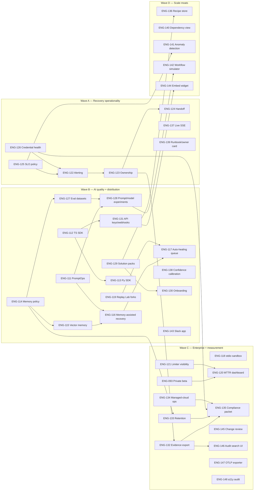
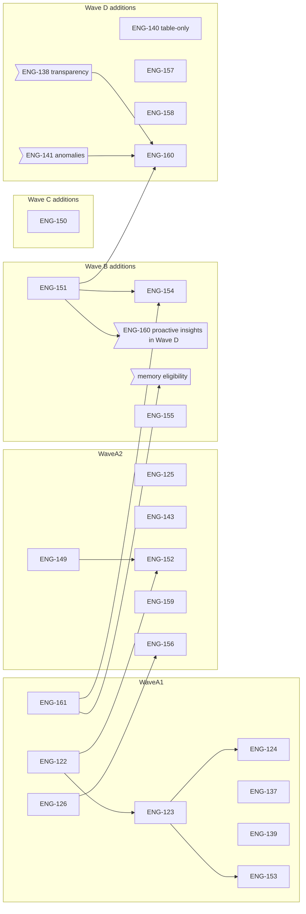

# Janusly World-Class Execution Plan — May 20, 2026

> Status: planning input for `docs/ROADMAP.md`, not the live ticket source. Treat
> this file as the next iteration of
> [`20260520-product-improvement-plan.md`](20260520-product-improvement-plan.md)
> and the operationalization of
> [`20260520-world-class-product-plan.md`](20260520-world-class-product-plan.md).
> Canonical ticket status remains in `docs/ROADMAP.md` section 3b.

## Purpose

The two earlier May 2026 proposals answered different questions:

- The improvement plan converted research into shippable tickets
  (`ENG-111..ENG-121`).
- The world-class plan defined the strategic bar — "Janusly is the recovery and
  control plane for AI workflows that matter in production" — and sketched a
  candidate backlog (`ENG-122..ENG-136`) without ticket-grade acceptance
  criteria.

This document is the bridge. It does three things:

1. **Validates ENG-111..ENG-121** against current code, AGENTS.md invariants,
   and shipped surfaces. Tightens AC where the original wording was ambiguous
   or under-specified.
2. **Promotes ENG-122..ENG-136** from "candidate" granularity to ROADMAP-grade
   tickets ready to enter §3b when the team decides to execute.
3. **Adds ENG-137..ENG-148** — twelve new tickets that fill gaps the existing
   plan does not cover but are required for world-class status in the operator
   recovery wedge: real-time UX, learned confidence calibration, distribution
   moats (Slack), enterprise governance (change review, audit search), and
   accessibility.

## Why these gaps matter

The recovery wedge is already strong on **breadth** (Recovery Center, Replay
Lab, structural patches, MCP client, SCIM, WorkOS, audit, sandbox dry-run).
Janusly's missing edge for "world-class" is **operational depth**:

| Dimension | Today | World-class gap |
| --- | --- | --- |
| Recovery feedback latency | Poll `GET /run` every few seconds. | Operators expect real-time stream of failures (Datadog / PagerDuty / GitHub bar of `1 new failure`). |
| AI confidence | LLM self-rates 0–100. | A self-rated 80% means nothing without calibration against historical accept/reject. |
| Recovery context | Failure signature + run timeline. | Operators need workflow ownership, runbook, and blast-radius graph inline. |
| Distribution moat | Slack/GitHub/email via `webhook.send`. | A native Slack app with interactive approvals shrinks "mean time to operator" from minutes to seconds. |
| Enterprise governance | Versioning + rollback per workflow. | Regulated buyers expect PR-style change review before production saves. |
| Compliance UX | Audit rows in DB. | Auditors need a filterable, exportable UI, not a SQL prompt. |
| Observability | Internal OTel + Prometheus. | Customer SREs want OTLP export into Datadog/Honeycomb. |
| Accessibility | Hand-written CSS, no formal audit. | WCAG 2.1 AA is table stakes for B2B procurement. |

The twelve new tickets (ENG-137..ENG-148) directly address those rows.

---

## Section 1 — Validation of ENG-111..ENG-121

The existing `ENG-111..ENG-121` block in `docs/ROADMAP.md` §3b is structurally
sound. Each ticket already aligns with shipped surfaces, has tenant-scoping
language, and respects AGENTS.md invariants (fail-soft on telemetry, deterministic
AI fallback, two-flag write consent, route registry, audit on every mutation).

The refinements below tighten ambiguity without changing scope.

| ID | Validation verdict | Refinement |
| --- | --- | --- |
| ENG-111 PromptOps | OK | Add: prompt variables MUST be rendered as data, never as interpolated instructions (same posture as `composeGenerationSystemPrompt` for MCP descriptions). Every resolved prompt invocation writes a `usage_events` row with `metric: "prompt.invoked"` and metadata `{ promptName, promptVersion, nodeId, runId }` so ENG-128 can A/B test prompts later without a second telemetry path. |
| ENG-112 TypeScript SDK | OK | Add: the SDK MUST surface budget-block 402 responses through a typed `JanuslyBudgetExceeded` error class that preserves the `budget` envelope so SDK consumers can show the same banner Janusly does. |
| ENG-113 Python SDK + webhook helper | OK | No changes; depends on ENG-112 as written. |
| ENG-114 Memory privacy policy | OK | Add: the policy MUST explicitly state that memory recall is read-only from the LLM's perspective and is framed as data (mirrors the MCP tool-description posture). The policy also must say what happens to memory entries on org deletion and on user-driven export. |
| ENG-115 Vector memory foundation | OK | Add: use Postgres 18 + `pgvector` (the AGENTS.md stack baseline already pins Postgres 18). The migration enables the `vector` extension `IF NOT EXISTS`. Embedding dimension is stored per row, not at column level, so a future provider swap does not require schema migration. |
| ENG-116 Memory-assisted recovery | OK | Add: the recalled memory budget is capped at N entries and M total bytes via `org_configs.memory.recallMaxEntries` (default 8) and `memory.recallMaxBytes` (default 8192). Hard caps enforced even when org overrides ask for more. |
| ENG-117 Supervised auto-healing queue | OK | Add: explicit loop-breaker shape — max 3 auto-healing attempts per `(orgId, failureSignature)` per 24h; on the 4th attempt the queue escalates to manual-only and writes `auto_healing.loop_breaker_tripped`. Kill switch is `JANUSLY_AUTO_HEALING_ENABLED=false` + `org_configs.autoHealing.enabled=false` — both must be true to operate; the AGENTS.md two-flag-consent posture carries through. |
| ENG-118 stdio MCP sandboxing | OK | Add: name the production mechanism — Linux posix_spawn with `process.resourceLimits` (Node 24's `worker_threads` rlimit-equivalent surface) plus an ephemeral `cwd` under `os.tmpdir()/janusly-mcp-<runId>` that is deleted on process exit. Document explicitly that macOS/Windows fall back to best-effort (no cgroups) and that production posture targets Linux. |
| ENG-119 Targeted Replay Lab forks | OK | Add: forks inherit the parent run's `replayMode="validation"` flag and the override editor caps inputs at 64 KiB per field (defense-in-depth on the safe-persist chokepoint). |
| ENG-120 MTTR/value dashboard | OK | Add: dashboard reads from `recovery_feedback` (already shipped) for accept/reject ratios and joins ENG-123's ownership state when promoted; until ENG-123 ships, the dashboard renders MTTR aggregates without owner attribution. |
| ENG-121 Rate-limit degradation | OK | Add: degradation surfaces as a new audit-style event written to `run_events`-equivalent or a new structured log channel (NOT `audit_logs`, since this is operational telemetry, not a security event). OperationsPanel shows an amber pill "Limiter degraded — non-blocking" when active. |

**Conclusion:** ENG-111..ENG-121 stay valid with the refinements above. No
renumbering, no scope cuts.

---

## Section 2 — Promoted candidate backlog (ENG-122..ENG-136)

The world-class plan listed these as candidates. The table below promotes them
to ROADMAP-grade AC. The format matches §3b convention exactly so the team can
copy these rows when ready to enter the active pool.

| ID | Title | Status | Priority | Phase | Scope |
| --- | --- | --- | --- | --- | --- |
| ENG-122 | Add recovery alerting policies | Pending | P1 | 3 | Add an org-scoped alerting layer above Recovery Center. AC: new `alert_policies` table keyed by `(orgId, name)` with closed-enum `trigger` (`dlq.entry_created`, `failure_cluster.threshold`, `budget.blocked`, `limiter.degraded`, `workflow.slo_breach`, `approval.stalled`), bounded `parameters` jsonb, `channels` jsonb listing one or more of email/slack-webhook/generic-webhook/github-issue (each channel references an existing `credentials` row — no new credential kind), `cooldownSeconds`, `enabled`; alert delivery routes through the existing `slack.post` / `webhook.send` / `email.send` / `github.create_issue` chokepoints so SSRF / body-cap / rate-limit / audit / usage events all apply; dedupe is per `(orgId, policyId, failureSignature)` within `cooldownSeconds`; route registry exposes admin CRUD plus `GET /alerts/recent` (viewer) for the operator UI; new audit actions `alert.policy.created/updated/deleted/triggered/suppressed`; no secret values appear in delivered payloads (the existing `safePersistPayload` + `scrubSecretShapes` chokepoints reach this surface). Tests cover dedupe, cooldown, tenant scope, missing-credential failure path, channel-level retry/backoff (relies on existing tool envelope `ok: false` contract), and EN/ES copy. |
| ENG-123 | Add recovery ownership workflow | Pending | P1 | 3 | Turn Recovery Center items into trackable incidents. AC: add a `recovery_items` table keyed by `(orgId, deadLetterId)` (one item per open DLQ row, even when the cluster has many members) with `owner`, closed-enum `severity` (`p1`/`p2`/`p3`/`p4`), `slaTargetAt`, closed-enum `status` (`open`/`acknowledged`/`in_progress`/`waiting_external`/`resolved`/`reopened`), `resolutionReason`, `comments` jsonb (append-only via API helper), `createdAt`/`updatedAt`; route registry exposes list/get/assign/acknowledge/escalate/resolve/reopen/comment with `permission: "recovery.write"` (new permission key, admin+editor by default); every transition writes audit `recovery.item.<transition>` and a `run_events`-style structured event so ENG-122 can alert on stalled SLA; tenant scope on every query; existing `FailureClustersCard` and `DeadLettersPanel` gain owner + severity badges; cluster-recover-all from ENG-094-era cluster apply creates child recovery_items for each accepted DLQ member; closure path requires either successful sandbox replay or explicit `resolutionReason` with closed-enum (`fixed_by_patch`/`rolled_back`/`upstream_fixed`/`accepted_loss`/`not_a_bug`). Tests cover role gates, audit rows, SLA clock, cross-org isolation, cluster-to-item fan-out, comments append-only, and EN/ES copy. |
| ENG-124 | Add incident handoff integrations | Pending | P1 | 3 | From a recovery_item, an operator can hand off context to the team's incident channel. AC: extend the existing `/reports/run-explain/deliver` route shape with a sibling `POST /recovery/items/:id/handoff` (`role: "editor"`, `"reports.deliver"` rate-limit bucket reused) that accepts `destination` (`slack`/`linear`/`github`/`webhook`) and `credentialName`; the handoff payload includes root cause, affected workflow/run, suggested fix label, validation status, recovery owner, severity, and a deep link back; Linear handoff uses existing `webhook.send` against the org's Linear webhook URL with HMAC signing (no new vendor SDK); idempotency is keyed by `(recoveryItemId, destination)` so a second handoff updates instead of duplicating (slack: same thread, github: edit issue body, linear: edit issue); audit action `recovery.handoff.<destination>` carries `ok`, `statusCode`, `latencyMs`, `credentialName` (never the env-var name); dry-run / validation-mode runs skip handoffs entirely. Tests cover idempotency, provider failures, redaction, dry-run gating, and audit metadata. |
| ENG-125 | Add workflow SLO policy engine | Pending | P1 | 3 | Workflows can define reliability SLOs that drive ENG-122 alerts. AC: extend `workflow_versions` with an `slo_json` column (nullable) containing closed-key SLO targets (`successRatePercent`, `mttrSeconds`, `p95DurationMs`, `budgetBlocksPerWindow`, `stuckWaitingNodesMax`, `windowDays` 7/14/30); SLO evaluation reuses `computeWorkflowHealth` signals (already shipped) without duplicate queries — health math returns SLO breach booleans alongside scores; new route `POST /workflows/:id/slo` (admin) writes the SLO and audits `workflow.slo.set`; breach detection fires an event consumed by ENG-122; UI surfaces SLO breach pill on health rollup. Tests cover window bounds, null SLO equals no-policy (does not block alerts based on default thresholds), threshold changes, alert triggering, and tenant scope. |
| ENG-126 | Add credential health preflight | Pending | P1 | 3 | Surface credential and tool issues before a run fails. AC: add `getCredentialHealth(orgId)` data helper that returns each credential's `secretRefPresent`, `lastUsedAt`, `lastErrorAt`, `lastErrorMessage` (scrubbed via `scrubSecretShapes`), `kind`; helper joins `usage_events` for last-use; route `GET /credentials/health` (viewer) returns the list; `checkWorkflowReadiness` (already shipped) gains a `credential_missing` warn rule that flags every referenced credential whose env-var resolves to undefined; Operations UI gets a "Credential health" card listing problems with explicit "this credential is referenced by workflows: ..." link (the env-var name is NEVER echoed — same posture as `executeTool`'s `credential secret missing for <name>` envelope); MCP connections show `status: pending|active|failed|disabled` plus the per-tool `enabled` count. Tests cover env-name redaction, multi-tenant scope, disabled MCP connection visibility, descriptor drift detection (descriptor count mismatch between current discovery and stored rows), and readiness rule firing. |
| ENG-127 | Build eval datasets from recoveries | Pending | P1 | 3 | Convert accepted/rejected recovery suggestions into reusable eval datasets with explicit opt-in. Depends on ENG-114 + ENG-116. AC: extend `recovery_feedback` (already shipped) with optional `evalConsent: boolean`; new `eval_datasets` and `eval_examples` tables scoped to `orgId`; admin route to create a dataset and pull approved examples; every example stores scrubbed input context, expected outcome, approval label, retention metadata; `scrubSecretShapes` runs at write time AND read time (defense in depth); examples can be exported as JSONL via existing report helpers. Tests cover opt-in enforcement (no consent → row not eligible), scrubbing, deletion/export, cross-org isolation, and prompt-injection framing (`evalExamples` are framed as data, never instructions, when surfaced to an LLM). |
| ENG-128 | Add prompt/model experiment harness | Pending | P1 | 3 | Operators can compare prompt versions and model choices against an eval dataset. Depends on ENG-111 + ENG-127. AC: new `experiments` table with `orgId`, `kind` (`prompt`/`model`/`prompt_and_model`), `controlRef` (promptVersion or model id), `candidateRef`, `evalDatasetId`, `status`, `summaryJson`; route `POST /experiments/run` (admin) executes deterministic eval — runs each example through both control and candidate via `LlmClient.generateText`, captures `costUsd`, `latencyMs`, `aiError`, and a configurable scorer (string equality, JSONSchema match, or LLM-as-judge with deterministic fallback); experiment runs are budget-gated by `gateBudget` and write `usage_events`; promotion is recommendation-only by default (no auto-replace of prod prompt/model); audit `experiment.run.started/completed/promotion_suggested`. Tests cover deterministic fixture evals, unknown-model fallback, cost null handling, no production mutation, and audit rows. |
| ENG-129 | Add solution packs | Pending | P1 | 4 | Ship installable, versioned solution packs aimed at the three ICPs (failed payment recovery, incident triage, support escalation). AC: solution packs live under `packages/solution-packs/` with one folder per pack containing `pack.json` (id, name, version, requiredCredentials, requiredOrgConfigs, workflowJson, samplePayloads, failureFixtures), README, and i18n strings; new route `POST /workflows/import-pack` (editor) creates a draft workflow version + records dependency hints (credential names not yet wired, missing org configs); pack install never auto-creates credentials — it lists what the operator must provide; sample-run is a one-click button that triggers a sandbox replay against the bundled payload; failure-injection mode lets the operator break a known node to see the recovery loop in action. Tests cover install/fork, missing credential checks, sample run, failure injection, and EN/ES copy. |
| ENG-130 | Add "first recovered run" onboarding | Pending | P1 | 4 | Guide new users from setup to one successful run and one intentionally failed/recovered run in under 60 minutes. Depends on ENG-129. AC: new `onboarding_progress` table keyed by `(orgId, userId)` with closed-enum `step` (`org_created`/`credential_configured`/`pack_installed`/`first_run_succeeded`/`failure_injected`/`recovery_applied`/`completed`); progress UI shows a top-banner checklist that links into the relevant panel and offers "skip" without hiding the underlying features; progress survives logout/login; restart/resume preserves any partial state; missing AI key shows the deterministic fallback path so onboarding does not deadlock without `ANTHROPIC_API_KEY`. Tests cover progress state, restart/resume, empty org, fallback when AI is unavailable, and EN/ES copy. |
| ENG-131 | Add public API keys and outbound webhooks | Pending | P1 | 4 | Distribution surface beyond the existing service-token model. AC: new `api_keys` table keyed by `(orgId, name)` with `prefix` (visible) + `hashedSecret` (argon2id or scrypt — Janusly does not store the raw key) + `scopes` closed-enum array (e.g., `runs.read`, `runs.start`, `workflows.read`, `dlq.read`) + `lastUsedAt` + `revokedAt`; admin CRUD with audit `api_key.created/revoked`; outbound webhook subscriptions table keyed by `(orgId, name)` with closed-enum `events` (`run.completed`, `run.failed`, `recovery_item.created`, `recovery_item.resolved`, `budget.blocked`, `dlq.entry_created`); delivery uses existing `webhook.send` chokepoint so HMAC signing, body cap, retry/backoff, and audit all apply; per-org rate limit on outbound webhook deliveries. Tests cover key scope, revocation, signature verification, retry/backoff, idempotency-via-event-id, and audit rows. |
| ENG-132 | Add audit evidence export | Pending | P1 | 3 | Compliance buyers need a single artifact per incident. Depends on ENG-123. AC: new `POST /recovery/items/:id/evidence` (editor) returns a JSON envelope + optional Markdown rendering (mirrors `/reports/run-explain` shape) containing run timeline (paginated cap respected), DLQ row, failure signature (scrubbed), AI explanation mode, selected patch diff (via shared `computeWorkflowDiff`), sandbox validation result, approval trail, audit rows scoped to `(runId, deadLetterId, recoveryItemId)`, and rollback link; secrets are redacted at the chokepoint and again at render time; output is downloadable via existing report helpers; audit `report.evidence.exported`. Tests cover redaction, tenant scope, large-timeline pagination, and stable JSON/PDF output. |
| ENG-133 | Add retention and archive policy | Pending | P1 | 3 | Customers can configure retention within safe bounds. Depends on ENG-114. AC: new safe `org_configs.retention.*` keys (`runEventsDays` range 7..365 default 90, `auditLogsDays` range 30..730 default 365, `usageEventsDays` range 30..365 default 90, `recoveryFeedbackDays` range 30..365 default 180, `memoryEntriesDays` range 7..730 default 90 — gated by ENG-114 memory policy); a background job (BullMQ scheduler-managed, audited as `retention.purged`) runs daily, deletes expired rows scoped to `orgId`, and writes a summary event; legal-hold bypass is a per-row `holdUntil` timestamp checked by the purge job. Tests cover catalog validation, retention job bounds, hold bypass, export-before-delete (operators can request an export job before purge), and cross-org isolation. |
| ENG-134 | Add managed-cloud ops runbook | Pending | P2 | 4 | Document and validate the managed-cloud posture. AC: a new `docs/ops/` set covers migrations, backups (Postgres logical + WAL archive, Redis snapshot policy), restore drill (script in `scripts/restore-drill.mjs` that can rehydrate a staging from a backup), worker scaling, queue health, Redis/Postgres failure behavior (matches the existing fail-open posture documented in AGENTS.md), deployment rollback, incident response, and support escalation; pricing/enterprise docs link to specific sections; quarterly restore-drill checklist. Validation: at least one restore-drill script + a CI smoke that boots a fresh Compose stack from a SQL dump fixture. |
| ENG-135 | Add compliance packet | Pending | P2 | 4 | Buyer-ready security packet. Depends on ENG-132 + ENG-133 + ENG-126. AC: a new `docs/security/` set covers auth model (Supabase + WorkOS SSO + SCIM + service token + dev headers, with `evaluateAuthPolicy` flow), tenant isolation (every query scoped by `auth.orgId`), audit actions catalog (stable list with descriptions), retention defaults (ENG-133), data use policy (memory + ENG-114), AI provider posture (Anthropic-only runtime), MCP consent (two-flag + per-tool + per-tenant), backup/restore (ENG-134), incident response, subprocess sandboxing (ENG-118); every claim links to code paths or roadmap status; roadmap items are marked honestly with current state. Validation: docs review + link health CI check. |
| ENG-136 | Add verified recipe store | Pending | P2 | 4 | Solution packs graduate into a versioned store. Depends on ENG-129. AC: extend pack metadata with `signature` (HMAC over canonical pack JSON with org-config'd `JANUSLY_RECIPE_SIGNING_KEY`), `compatibility` (min Janusly version), `riskLabel` (read-only/write-side/destructive), `ownerOrg`; new route `GET /recipes/store` (viewer) lists verified recipes; install path checks signature + compatibility; recipes can be forked into a draft workflow; downgrade/revert is supported via version pinning. Tests cover signature mismatch rejection, version pin, upgrade preview, downgrade/revert, credential requirement check, and tenant isolation. |

---

## Section 3 — New world-class additions (ENG-137..ENG-148)

Twelve net-new tickets. Each addresses a gap the existing plan does not cover.
Format identical to §3b.

| ID | Title | Status | Priority | Phase | Scope |
| --- | --- | --- | --- | --- | --- |
| ENG-137 | Add live run streaming over SSE | Shipped (see ROADMAP §3b) | P1 | 3 | Replace polling for active runs with a tenant-scoped SSE stream so operators see failures in real time. AC: new route `GET /runs/:runId/stream` (viewer, `runs.read`) opens an SSE connection that fans `run_events` rows + `runs.status` transitions to subscribed clients via Redis pub/sub (Redis is already a dep); per-org subscription cap (default 50, configurable via `org_configs.runs.streamMaxSubscriptions`); each event payload reuses the same `safePersistPayload` shape used by the polling route so secrets stay redacted; stream auto-closes on terminal status + 30s grace; web `RunsPanel` + `RecoveryCenterPanel` open the stream on the active run and fall back to polling when SSE is blocked (corporate proxy); Operations card shows a "Live" pill while a stream is healthy; never deliver events to a different org's subscriber; SSE is gated by `auth.orgId` at connection time AND at every event publish. Tests cover cross-org isolation (a different org's run on the same Redis channel never reaches the wrong subscriber), reconnect with `Last-Event-ID`, fallback to polling when SSE returns 502, subscription cap, and no secret leakage in streamed payloads. |
| ENG-138 | Add AI suggestion confidence calibration | Pending | P1 | 3 | Calibrate LLM self-rated `confidence` against observed accept/reject in `recovery_feedback`. AC: new `confidence_calibrations` table keyed by `(orgId, approachLabel)` storing rolling 30-day accept rate, sample size, last computed, and a calibrated curve (linear in v1: `calibrated = a * raw + b` with `a`/`b` solved from observed rate per raw confidence bucket); a daily BullMQ job per org recomputes; `/ai/patch-workflow` route reads the calibration before responding and emits BOTH the raw and calibrated confidence; the recovery dialog renders the calibrated value as the primary number with a small "(model self-rated X%)" subtitle when the two differ by ≥10 points; fewer than 20 samples in the window → calibration is skipped and raw confidence is shown unchanged; audit `confidence.calibration.computed` daily summary row; opt-out via `org_configs.ai.confidenceCalibrationEnabled` (default true). Tests cover sample-size threshold, monotonicity (calibration never inverts ordering of suggestions), tenant scope, missing org config falls back to raw, and absence of `recovery_feedback` rows returns raw. |
| ENG-139 | Add per-workflow runbook + ownership card | Pending | P1 | 3 | Inject workflow-level context (owner, runbook, change-log) directly into the recovery dialog. AC: new `workflow_metadata` table keyed by `(orgId, workflowId)` with `owners` (closed array of user ids), `runbookMarkdown` (capped at 32 KiB), `description`, `tags`, `slackChannel`, `linearProject`, `severityDefault`; route `POST /workflows/:id/metadata` (editor) with audit `workflow.metadata.set`; recovery dialog renders an "About this workflow" panel showing owner avatars, the runbook rendered through the safe Markdown subset already used by `pdf.generate`, and links to slackChannel/linearProject (defense-in-depth: links go through the suspicion check before becoming clickable when they appear in an AI-generated context, but operator-supplied links bypass that); ENG-123 recovery_items default `owner` to the workflow's first owner when assigned; ENG-122 alert policies can default `channels` to slackChannel. Tests cover Markdown size cap, EN/ES copy, link safety, and audit rows. |
| ENG-140 | Add cross-workflow dependency view | Pending | P2 | 4 | Visualize blast radius across workflows so operators see what breaks when workflow A breaks. AC: new `workflow_dependency_edges` table (derived, not authoritative) populated by a background pass that reads each workflow version's `subworkflow` nodes + `webhook.send` URLs matching another workflow's webhook trigger + `mcp_tool` aliases shared between workflows; the pass is idempotent and runs on every workflow save; route `GET /workflows/:id/dependencies` (viewer) returns `upstream` and `downstream` arrays with edge type; web renders a force-directed mini-graph in the workflow detail panel + the recovery dialog ("3 downstream workflows depend on this; 2 are healthy, 1 has open recovery items"); tenant scope at both write and read time. Tests cover subworkflow detection, webhook URL match heuristic, no-edge case, and tenant scope. |
| ENG-141 | Add anomaly detection on workflow health | Pending | P2 | 3 | Catch statistical regressions that don't trip a static SLO. Depends on ENG-125. AC: a daily BullMQ job per org reads the last 14 days of run outcomes per workflow and computes rolling baseline (mean + stddev) of success rate, p95 duration, cost-per-run; any new run-window where a metric crosses 2σ from the rolling baseline writes an `anomaly_signals` row keyed by `(orgId, workflowId, metric)` with `severity` derived from σ-distance; ENG-122 alert policies can subscribe to `anomaly.detected` triggers; anomalies decay automatically when the metric returns within band; UI surfaces an amber/red dot on the workflow card; opt-out via `org_configs.workflowHealth.anomalyDetectionEnabled` (default true). Tests cover small-sample suppression (fewer than 50 runs → no anomaly), z-score boundary, decay, tenant scope, and EN/ES copy. |
| ENG-142 | Add workflow-shape simulator | Pending | P2 | 3 | Replay historical traffic against a candidate workflow version to predict impact. Different from ENG-128 (prompt/model evals against fixed datasets) — this varies the workflow shape. AC: new route `POST /workflows/:id/simulate` (editor) with `candidateVersionId` + `sourceRunIds[]` (cap 100); the route enqueues a Replay-Lab-style validation run per source, but uses the candidate version instead of the source version; results aggregate into `simulation_runs` table with `successRate`, `p95DurationMs`, `costUsdSum`, `divergencePoints` (nodes where outputs diverged from the source run); audit `workflow.simulated`; budget-gated via `gateBudget`. Tests cover cap enforcement, divergence detection, dry-run gate (write-side tools still skipped), budget block, and tenant scope. |
| ENG-143 | Ship native Slack app | Pending | P1 | 4 | Native Slack distribution that turns approvals + recovery into Slack-first UX. AC: new `packages/slack-app` running as a tiny separate Node service (or hosted by the API process behind a `/slack/*` route prefix) that handles Slack Events API + Interactivity URLs; OAuth install flow writes a `slack_installs` row keyed by `(orgId, teamId)`; slash commands `/janusly status`, `/janusly recover <runId>`, `/janusly approve <approvalId>` route through the existing API with the org resolved from the Slack install; interactive buttons on approval messages call `POST /approvals/:id/resume` with the click as the approver identity; events for `run.failed` and `recovery_item.created` deliver as Block Kit messages with action buttons inline; signing-secret HMAC verification on every Slack request; per-install rate limit; audit `slack.install.created/uninstalled`, `slack.command.invoked`, `slack.interaction.handled`. Tests cover signature verification, replay protection (timestamp + nonce), cross-org isolation (a Slack team can only resolve to its bound org), and EN/ES copy on bot-emitted strings. |
| ENG-144 | Add embeddable recovery widget | Pending | P3 | 4 | A read-only JS snippet customers can embed in their internal admin tools to see workflow health without logging into Janusly. AC: new `packages/embed-widget` builds a single ~30 KB gzipped JS bundle that mounts a read-only health card; widget reads via signed-URL token (HMAC over `{orgId, workflowId?, viewerKind: "embed"}` with 30-day expiry, rotatable); CORS allows configured origins per org via `org_configs.embed.allowedOrigins`; widget never sends mutating requests; CSP guidance documented; the bundle is served from the API origin (no third-party CDN). Tests cover token expiry, CORS, no-mutating-endpoint enforcement, multi-origin support, and tenant scope. |
| ENG-145 | Add workflow change review (PR-style) | Pending | P2 | 4 | Optional PR-style review before workflow saves land in production. AC: new `workflow_change_requests` table keyed by `(orgId, workflowId)` with `proposerUserId`, `proposedWorkflowJson`, `baseVersionId`, closed-enum `status` (`open`/`approved`/`rejected`/`merged`), `reviewers` (array of user ids), `comments` jsonb; per-workflow setting `requiresReview: boolean` (default false — opt-in); when set, `POST /workflows/save` creates a change-request instead of a new version; route `POST /workflow-change-requests/:id/approve|reject|merge` (editor for self-review-disabled, admin for self-review-enabled); merge applies the proposed workflow via the existing `/workflows/save` chokepoint with `actor.userId = mergerUserId`; reviewers see the existing `WorkflowDiffView` inline; audit `workflow.change_request.<transition>`. Tests cover opt-in, self-review setting, multi-reviewer requirement, reject reopens, diff render, and tenant scope. |
| ENG-146 | Add audit log search and export UI | Pending | P2 | 4 | Compliance-grade filterable audit surface. Depends on ENG-132 + ENG-133. AC: new route `GET /audit-logs/search` (admin, `audit.read` permission) with filters `actorUserId`, `action` (closed-enum or prefix match), `resourceType`, `resourceId`, `fromTs`, `toTs`, `cursor`; capped at 500 rows per page; index-friendly query shape (composite index `(orgId, createdAt DESC)` already exists in schema); export via existing report helpers (CSV + JSON) with secret redaction at render time (extra defense beyond the safe-persist chokepoint); admin UI panel mounts in Operations with `we-list-row` pattern; auditors can save filter presets per user (`audit_log_filter_presets` table). Tests cover cursor pagination, cross-org isolation, redaction at export, large-result truncation, and EN/ES copy. |
| ENG-147 | Add OTLP exporter + Grafana dashboard pack | Pending | P2 | 4 | Customer SREs can ingest Janusly telemetry into their own observability stack. AC: extend `packages/engine/src/observability/` so OTel traces and metrics can be re-exported to a customer-supplied OTLP endpoint scoped per org via `org_configs.observability.otlpEndpoint` + `org_configs.observability.otlpHeaders` (validated CRLF-free); exporter shares the existing `fetchHttpTarget` chokepoint so SSRF / DNS-pin / body-cap apply uniformly; per-org redaction list applied before export so secret-shaped keys never leave Janusly; package a Grafana JSON dashboard set (`docs/observability/dashboards/`) showing Recovery Center KPIs (MTTR, success rate, budget burn, queue depth, DLQ rate, p95 latency); docs include Datadog / Honeycomb / Tempo / Mimir adapter notes. Tests cover OTLP retry/timeout, secret redaction at export, multi-tenant isolation (org A's endpoint never receives org B's spans), and dashboard JSON schema validity. |
| ENG-148 | Add WCAG 2.1 AA accessibility audit | Pending | P2 | 4 | Lock in a world-class accessibility bar across the web. AC: add `@axe-core/playwright` to the existing browser-mode Vitest + Playwright stack; new `apps/web/src/**/*.a11y.browser.test.tsx` set runs axe-core against every top-level panel (Home, AI Studio, Workflows, Runs, DLQ, Operations, Members, Versions, Recovery dialog, Replay Lab dialog, Run-explain dialog, Onboarding banner from ENG-130); axe-core violations at "serious" or "critical" severity fail CI; documented Storybook-equivalent dev surface (we don't need Storybook itself — a `pnpm --filter @janusly/web a11y` script that boots Vite + runs the suite is enough); high-contrast mode is verified via existing dark/light tokens; keyboard-only nav verified for the Cmd-K palette + every dialog focus trap. Tests are the suite itself plus a smoke test that a known-bad fixture (e.g., a `<button>` without an accessible name) actually fails the gate, so the gate cannot silently bit-rot. |

---

## Section 4 — Revised dependency graph



---

## Section 5 — Wave-based sequencing recommendation

The ROADMAP §3a currently lists sequencing item 6 as "May 2026 improvement
backlog: ENG-111..ENG-121". Extend it to four waves:

> 7. **Wave A — Recovery operationality (next 6 weeks):** ENG-122, ENG-123,
>    ENG-124, ENG-125, ENG-126, ENG-137, ENG-139. These turn Recovery Center
>    from a panel into an operational cockpit with alerting, ownership,
>    incident handoff, SLO breach detection, credential preflight, real-time
>    failure stream, and inline workflow context.
> 8. **Wave B — AI quality + distribution (6–14 weeks):** ENG-111, ENG-114,
>    ENG-115, ENG-116, ENG-117, ENG-119, ENG-127, ENG-128, ENG-138, ENG-112,
>    ENG-113, ENG-129, ENG-130, ENG-131, ENG-143. These ship PromptOps,
>    privacy-gated memory, supervised auto-healing, targeted Replay Lab forks,
>    eval datasets from real recoveries, prompt/model experimentation,
>    calibrated confidence, SDKs, solution packs, onboarding, public webhooks,
>    and a native Slack app.
> 9. **Wave C — Enterprise + measurement (14–22 weeks):** ENG-093 (in-flight),
>    ENG-118, ENG-120, ENG-121, ENG-132, ENG-133, ENG-134, ENG-135, ENG-145,
>    ENG-146, ENG-147, ENG-148. These ship private-beta data, stdio MCP
>    hardening, MTTR dashboard, limiter visibility, evidence export, retention,
>    managed-cloud ops, compliance packet, PR-style change review, audit search,
>    OTLP exporter, and WCAG 2.1 AA accessibility.
> 10. **Wave D — Scale moats (22+ weeks):** ENG-136, ENG-140, ENG-141, ENG-142,
>     ENG-144. Verified recipe store, cross-workflow dependency view, anomaly
>     detection, workflow-shape simulator, and the embeddable widget.

---

## Section 6 — Implementation standards (extended)

Carry forward from `20260520-product-improvement-plan.md`, plus the new ones
required by the additions above.

- Every new route registers through the route registry in `apps/api/src/index.ts`
  — no inline `if (req.method === "POST" && req.url === ...)` branches.
- Every query is tenant-scoped with `eq(<table>.orgId, auth.orgId)` or an
  equivalent join through `workflow_versions`.
- Every AI path preserves deterministic fallback with `{ mode, aiError }`.
- Every mutation writes an audit row with a stable, closed-enum action name.
- Every user-facing string goes through the EN/ES i18n catalog; parity is
  enforced by `apps/web/src/i18n/parity.test.ts`.
- Every frontend change uses the existing CSS-first Tailwind 4 tokens and
  `@xyflow/react`. No new web deps beyond the AGENTS.md allowlist.
- Every SDK and Slack-app surface calls the public API; they do not duplicate
  server authorization logic.
- Every memory or eval-dataset feature treats stored content as customer data,
  not training data by default.
- Every embedding row records `provider`, `model`, and `dimension` so provider
  changes are explicit re-embedding work, not silent corruption.
- Every auto-healing write path has a process-wide flag, a tenant flag, a kill
  switch, a loop breaker, and an audit trail.
- Every outbound integration (Slack app, OTLP exporter, embed widget,
  webhook subscriber) routes through `fetchHttpTarget` so SSRF / DNS-pin /
  body-cap / timeout / redirect guards apply uniformly. No vendor SDKs.
- Every new background job that touches tenant data carries `orgId` end-to-end
  and writes a structured event when it runs, so operators can see whether the
  job is active in their tenant.
- Every SSE/streaming surface verifies `auth.orgId` at connection time AND at
  every event publish, never at one only.
- Every Markdown surface that may contain operator-supplied content (runbooks,
  alert messages, recovery comments) uses the same safe Markdown subset already
  used by `pdf.generate`.
- Every retention/archive job is idempotent and respects per-row legal holds.

---

## Section 7 — Risk register

| Risk | Mitigation |
| --- | --- |
| Confidence calibration (ENG-138) inverts ordering of suggestions and hides high-quality fixes behind low calibrated scores. | The AC requires a monotonicity test — calibration must preserve raw-confidence ordering. The 20-sample threshold prevents premature curve fitting. |
| Live SSE (ENG-137) leaks events across orgs through a misrouted Redis channel. | Channel naming is `janusly:run-events:<runId>` and every published message carries `orgId`; the route gates on `run.orgId === auth.orgId` before subscribing and the hub verifies `message.orgId === subscriber.orgId` before delivery. The cross-org isolation test is explicit in the AC. |
| Slack app (ENG-143) becomes a surface for replay attacks (a recorded interactive button click resubmitted). | Slack signs every request with a timestamp + signature; the AC mandates timestamp tolerance ± 5 minutes AND a nonce dedupe table that drops duplicates within the window. |
| OTLP exporter (ENG-147) exfiltrates secrets via span attributes. | Pre-export redaction list runs through `safePersistPayload`'s sensitive-key regex AND `scrubSecretShapes` for free-text span messages. No exporter dispatch without both layers. |
| Embedded widget (ENG-144) becomes a credential leak vector if signed URLs are forwarded. | Tokens are scoped to `viewerKind: "embed"`, never grant mutating access, and CORS enforces configured origins. Tokens are rotatable per org so a leaked token can be invalidated without breaking other origins. |
| Workflow simulator (ENG-142) double-spends on AI calls when replaying many runs. | Budget-gated via `gateBudget`; per-org rate limit on `"workflows.simulate"` bucket; sandbox dryRun gate keeps write-side tools skipped just like Replay Lab. |
| Anomaly detection (ENG-141) alert-storms on cold workflows that swing between 1 and 0 successes. | Small-sample suppression: fewer than 50 runs in the window → no signal. Decay rule: anomaly auto-clears when the metric returns within band. ENG-122 cooldown applies on top. |
| Retention purge (ENG-133) deletes audit rows needed for an active investigation. | Per-row `holdUntil` bypass; admin-controllable; default audit-log retention floor is 365 days, never less. |
| Change-review (ENG-145) blocks emergency fixes during incidents. | Per-workflow opt-in; admins can disable for the emergency path; the existing direct `POST /workflows/save` route stays as the chokepoint — change-review wraps it instead of replacing it. |
| stdio MCP sandbox (ENG-118) breaks legitimate stdio servers that need fs writes (e.g., a server that caches to `~/.cache/foo`). | The AC scopes the sandbox to production; dev mode is unchanged. The sandbox profile is opt-in via `org_configs.mcp.stdioSandboxEnabled` (default true in production, false in dev). |

---

## Section 8 — Out of scope (explicit rejects, carry-forward + new)

Carry forward from `20260520-product-improvement-plan.md`:

- Reusing `ENG-102`..`ENG-110` numbering (those IDs already exist).
- Express middleware (Janusly's API is plain Node HTTP + route registry).
- `reactflow` imports (the web app uses `@xyflow/react`).
- Inline hex in implementation guidance (CSS-first Tailwind 4 tokens only).
- Rate limiter fail-closed fallback (Redis limiter is fail-open by design).
- OpenAI-specific embedding assumptions in schema or column types.
- Unsupervised production mutation as default behavior.

New rejects added by this plan:

- **No vendor SDKs** for Slack (ENG-143), Linear (ENG-124), OpenTelemetry
  exporters (ENG-147), or webhook receivers. Everything goes through
  `fetchHttpTarget` so the SSRF / body-cap / timeout chokepoint applies
  uniformly.
- **No raw API-key storage.** ENG-131 hashes secrets at rest; the only thing
  shown to the operator after creation is the prefix.
- **No auto-promotion of prompt or model experiments.** ENG-128 is
  recommendation-only by default.
- **No global Storybook scaffolding** for ENG-148. The accessibility gate runs
  through the existing browser-mode Vitest + Playwright stack.
- **No third-party CDN delivery for the embed widget.** ENG-144 serves the
  bundle from the API origin so origin policy and CORS can be enforced
  end-to-end.
- **No PII in OTLP spans.** ENG-147 redacts before export; secrets and
  user-identifying fields stay inside Janusly.
- **No cross-region storage primitives in this wave.** A multi-region story is
  a separate decision that depends on customer demand and on the data-residency
  policy carried by ENG-114 + ENG-133.

---

## Section 9 — Measurement scorecard (extended)

Carry forward from the world-class plan, plus new metrics enabled by this
execution plan:

| Metric | Target | Enabled by |
| --- | --- | --- |
| Time to first recovered run | < 60 min for a new technical operator | ENG-130 |
| Private-beta MTTR delta | 10× median improvement, or documented reason why not | ENG-093 + ENG-120 |
| Recovery suggestion validation pass rate | > 70% for high-confidence suggestions | ENG-138 + existing sandbox replay |
| Calibrated-confidence accuracy | predicted accept rate within ±10 points of observed at sample size ≥ 50 | ENG-138 |
| Production mutation audit coverage | 100% | existing + ENG-132 export |
| Sandbox-before-save coverage | 100% for AI-suggested recovery patches | existing |
| Cross-org isolation incidents | 0 | non-negotiable across all tickets |
| Live-stream uptime | ≥ 99.9% per month on `/runs/:runId/stream` | ENG-137 |
| Alert dedupe accuracy | no duplicate alert storm per failure signature in cooldown | ENG-122 |
| Evidence-export completeness | packet includes timeline, patch, validation, approval, audit, rollback link | ENG-132 |
| SDK time to start/poll/report | < 15 min from docs for a technical user | ENG-112 / ENG-113 |
| Slack-to-approval median latency | < 30 seconds from message to button-click resume | ENG-143 |
| WCAG violations in CI | 0 at "serious" or "critical" severity | ENG-148 |
| OTLP redaction violations | 0 secret-shaped values leaving the OTLP exporter | ENG-147 |

---

## Section 10 — Recommended execution order (one-paragraph version)

Ship Wave A (`ENG-122/123/124/125/126/137/139`) first — these turn the Recovery
Center from a panel into an operational cockpit and unlock the metrics
Janusly's sales narrative needs. In parallel, finish ENG-093 so Wave C's MTTR
dashboard has real data when it lands. Wave B is the AI quality + distribution
layer (`ENG-111/114..117/119/127/128/138/112/113/129..131/143`) and forms the
"this AI improves itself safely" story. Wave C closes the enterprise contract
(`ENG-118/120/121/132..135/145..148`). Wave D is the moat
(`ENG-136/140/141/142/144`) — only once the wedge is proven.

If one sentence survives this plan, keep this:

> Janusly reaches world-class status when an operator at 3am opens Slack, sees
> "workflow A failed — calibrated 84% chance the secret-rotation fix works,
> validated in sandbox 30 seconds ago, click to approve," approves, and goes
> back to sleep — with a full evidence packet waiting for the compliance team
> on Monday.

---

## Section 11 — Iteration 2: post-review revisions (May 20, 2026)

Honest gap audit after writing Sections 1–10. This section is purely additive
to the file's history — earlier sections stay valid as written. When a ticket
in this section conflicts with an earlier section, this section wins.

### 11.1 Cuts and defers

| Action | Ticket | Reason |
| --- | --- | --- |
| **Cut** | ENG-144 embeddable widget | YAGNI until a customer asks for it specifically. No private-beta partner has requested customer-app embedding. Re-open the ticket when one does. |
| **Defer indefinitely** | ENG-142 workflow-shape simulator | Multiplies AI cost per simulated run; power-user surface; not what moves the private-beta needle. Probably belongs in a paid tier or is replaced entirely by ENG-160 proactive insights engine's recommendations. |
| **Cut from Wave D** | ENG-140 cross-workflow dependency view (visual graph) | Force-directed graph is overkill for most teams (<30 workflows). Replace with a flat `GET /workflows/:id/dependencies` table — same data, 90% of the value, 10% of the build cost. The ticket stays but its AC simplifies to "table only, no SVG graph in v1". |

### 11.2 Modifications to earlier tickets

| Ticket | Modification | Why |
| --- | --- | --- |
| ENG-143 native Slack app | **Wave bumped from B → A.** | Interactive Slack approval is the killer 3am-operator demo. Without it, Wave A's recovery story competes on Datadog's turf instead of operating where the operator already lives. |
| ENG-127 eval datasets + ENG-128 prompt/model experiments | **Bundled into a single delivery.** Each keeps its ID but they ship as one PR set; the AC remains as written. | Eval datasets without experiments are inert data; experiments without datasets are toys. Separating them only adds ceremony. |
| ENG-138 confidence calibration | **v1 simplified to "confidence transparency", calibration math moves to v2.** AC v1: display the per-`approachLabel` 30-day accept rate as an inline fact next to the LLM's self-rated confidence ("operators in your org accepted `add_retry` patches 87% of the time"). The calibrated linear curve, monotonicity guarantee, and daily background job all move to a follow-up ticket (will be filed when v1 ships and there is evidence the operator wants the math, not just the transparency). | Faster trust-building, less infrastructure, easier to interpret. The transparency surface is also the right read-time UX whether or not calibration math is computed underneath. |
| ENG-140 dependency view | **Visual graph cut; flat-table only.** | See §11.1. |

### 11.3 New tickets (ENG-149..ENG-161)

Thirteen additions. Numbered continuing from ENG-148. Each follows the
ROADMAP §3b convention.

| ID | Title | Status | Priority | Phase | Scope |
| --- | --- | --- | --- | --- | --- |
| ENG-149 | Add mobile-first approval + PWA + push | Pending | P1 | 3 | Lock in on-call UX for the 3am operator. AC: add a PWA manifest (`apps/web/public/manifest.webmanifest`) using existing design tokens; service worker handles an offline approval queue (tap actions while offline are queued and sync on reconnect); web push via VAPID — no third-party push service; new `push_subscriptions` table keyed by `(orgId, userId)` with the public key + endpoint; new `user_preferences` table for per-user notification routing (quiet hours, severity floor, opted-in event types); push fires for `recovery_item.created`, `approval.pending`, `workflow.slo_breach`; approval pages re-laid-out for thumb reach (CTA bottom, 56px tap target, swipe-to-dismiss); ENG-137 SSE auto-reconnect on app-foreground; audit `push.subscribed/unsubscribed/delivered`. Tests cover offline queue replay, VAPID payload signing, tap-target sizes (via axe), per-user opt-out, and cross-org isolation. |
| ENG-150 | Add upstream health awareness | Pending | P1 | 3 | Skip recovery cycles when the upstream provider is degraded. AC: new `upstream_health_sources` table keyed by `(orgId, name)` with closed-enum `kind` (`statuspage_io`, `atlassian_statuspage`, `http_probe`, `custom_feed`), `url`, `expectedComponents` (JSON list), `checkIntervalSeconds`, `enabled`, plus a derived `lastStatus` field; background job polls feeds through `fetchHttpTarget` (SSRF / body-cap / timeout chokepoint applies) at the configured interval; when a referenced component flips to `degraded`/`major_outage`, workflows tagged with that source's `name` (new optional `workflow_versions.upstreamHealthSources: string[]` field) auto-pause with status `paused_upstream_degraded` + audit `workflow.paused.upstream`; paused workflows reject new run starts with HTTP 409 + `code: "upstream_degraded"` envelope; auto-resume when the component recovers; operators can force-run during pause via an explicit button (audit `workflow.force_run_during_pause`); fail-open on feed unreachable (do NOT auto-pause when we can't reach the status page — that would amplify outages). Tests cover statuspage.io JSON parsing, missing-component handling, manual override, fail-open on feed timeout, and cross-org isolation. |
| ENG-151 | Add AI evidence panel | Pending | P1 | 3 | Surface the data the LLM used to derive a suggestion. AC: extend `/ai/patch-workflow`, `/ai/explain-run`, and `/ai/suggest-improvement` responses with `evidence: Array<{ kind, sourceRef, snippet, weight? }>` listing what was in the prompt context — `recovery_feedback` hits, memory entries (when ENG-115 enabled), runbook excerpts (when ENG-139 shipped), recent similar errors, signature normalization rule that fired, and the per-tool `inputContract` for tool-typed failures; the prompt composer emits the evidence list as a structured side-channel (no second LLM call); recovery dialog renders a collapsible "Why this suggestion?" panel with chip links to each source (run id, recovery item id, memory entry id); evidence rows pass through `scrubSecretShapes` at read time even though they were scrubbed at write time; never include evidence from a different org; an empty evidence array is a valid response. Tests cover empty case, source link integrity, redaction at read, tenant scope, and EN/ES copy. |
| ENG-152 | Add notification routing intelligence | Pending | P1 | 3 | Avoid alert fatigue. Depends on ENG-122 + ENG-149. AC: new `oncall_schedules` table per org (weekly rotation + manual overrides, JSON shape); extend ENG-122's `alert_policies.routing` JSON with `oncallScheduleId`, `severityHoldUntilLocal`, `escalationLadder` (array of `{ delaySeconds, channel }`); routing computed at fire time using closed precedence (explicit override → on-call → severity hold → channels); held alerts release at boundary via the existing BullMQ scheduler; escalation fires a second alert (with explicit `metadata.escalatedFrom`) when the parent isn't acknowledged within the delay; ENG-149 push respects `user_preferences.quietHours`; audit `alert.routed`, `alert.escalated`, `alert.held_until`. Tests cover on-call rotation correctness, quiet-hours boundary (DST-safe), escalation ladder firing, held alert release, no-double-page on rapid ack, and cross-org isolation. |
| ENG-153 | Add recovery cooldown / debounce | Shipped (see ROADMAP §3b) | P1 | 3 | One recovery item per failure storm, not one per DLQ row. Depends on ENG-123. AC: when a new DLQ entry arrives with the same `(orgId, workflowId, failureSignature)` as an existing open `recovery_items` row within `org_configs.recovery.debounceWindowSeconds` (default 300, bounds 30..3600), the new row attaches as a child to the existing item (`recovery_item_children` table keyed by `(recoveryItemId, deadLetterId)`) instead of creating a new item; parent carries `occurrenceCount`, `firstOccurredAt`, `lastOccurredAt`; UI surfaces "12 occurrences in last 5 min" badge with a child-DLQ drawer; ENG-117 auto-healing queue treats the parent + children as one cycle; ENG-122 alert policies dedupe over the parent, not per-DLQ; closing a parent closes all children. Tests cover window boundary, multi-workflow signature collision, debounce=0 (off), cluster-apply (ENG-094 v2) interaction with debounced items, and tenant scope. |
| ENG-154 | Add conversational AI Studio + recovery chat | Pending | P1 | 3 | Replace prompt-and-pray with multi-turn conversation. Depends on ENG-151. AC: new route `POST /ai/chat` (editor) with body `{ contextKind: "recovery_item" \| "workflow_authoring", contextId, message, expectMutation?: boolean }`; route runs through `LlmClient.generateText` (or `generateObject` when an authoring turn proposes a workflow shape) with the same fallback contract; session state stored in `ai_chat_sessions` table keyed by `(orgId, userId, contextKind, contextId)` with append-only messages capped at 50 turns and an inactivity-driven 30-day expiry job; **recovery context** — LLM has access to ENG-151 evidence aggregator + existing patch-workflow context + the recovery_item timeline; **authoring context** — LLM asks clarifying questions before emitting any workflow proposal, then runs a dry-test on a sample input via Replay Lab validation mode, surfaces what would happen, and commits only on explicit operator confirm; every turn is budget-gated via `gateBudget` (block degrades to a "you've hit the budget — here's the deterministic summary so far" path that preserves session state); audit `ai.chat.message_sent`, `ai.chat.workflow_proposed`, `ai.chat.committed`; chat messages never auto-mutate production state. Tests cover multi-turn coherence, budget block mid-session, fallback when LLM errors, session expiry cleanup, tenant isolation, no mutation without explicit confirm, and EN/ES copy. **v1 ships recovery context first**; authoring context is enabled by a separate `org_configs.ai.chatAuthoringEnabled` flag (default false) so the AI Studio rewrite can roll out behind the same chat surface without forcing existing users into the new flow. |
| ENG-155 | Add workflow snippets library | Pending | P1 | 4 | Composable patterns to drop into a workflow. AC: new `snippets` table per org with `name`, `description`, `tags`, `nodesJson`, `edgesJson`, closed-enum `category` (`retry`, `approval`, `error_handling`, `notification`, `transform`, `custom`), `builtin: boolean`, `createdBy`; ship 8 built-in snippets (`retry-with-backoff`, `approval-with-timeout`, `slack-on-failure`, `condition-then-branch`, `parallel-fan-out`, `transform-and-cache`, `http-with-circuit-breaker`, `dlq-friendly-error-flow`); admin route to create org-private snippets; canvas Inspector gets an "Insert snippet…" command + Cmd+K palette entry; insertion is a delta on the current workflow JSON (new nodes get fresh ids via `nanoid`, edges stitch to the operator-selected target node); snippets cannot run standalone — they only insert; built-ins are read-only and live in code, not in the DB; org-private snippets respect tenant scope; audit `snippet.created/updated/deleted/inserted`. Tests cover id collision resolution, edge stitching to an existing target, EN/ES copy on built-ins, built-in immutability, and tenant isolation for custom snippets. |
| ENG-156 | Add bulk credential rotation | Shipped (see ROADMAP §3b) | P1 | 3 | Rotate a credential referenced by N workflows in one move. Depends on ENG-126. AC: new route `POST /credentials/:name/bulk-update` (admin, `credentials.write` permission) accepts `{ newSecretRef, dryRun: boolean }`; dry-run returns the affected workflow list (id + name + node ids referencing the credential) without mutating; non-dry-run updates the `credentials.secretRef` field, writes audit `credential.bulk_updated` listing every affected workflow id, and triggers ENG-126 readiness recomputation for each; the new secret value is NEVER returned (env-name posture preserved from `executeTool`); concurrent saves on affected workflows during the bulk update are reconciled by an optimistic-concurrency guard (`if-match` on `credentials.updatedAt`); UI surfaces a 2-step modal (preview → confirm). Tests cover env-name-not-echoed, multi-workflow affected list, dry-run vs commit, audit row shape, concurrency guard, and tenant isolation. |
| ENG-157 | Expand trigger surface | Pending | P2 | 3 | More ways to start workflows without code. AC: add three new trigger node types following the existing `webhook`/`schedule`/`approval` pattern: `email_received` (per-org alias `<key>@triggers.janusly.app` resolved via a tiny SMTP relay OR a customer-controlled SES/Mailgun forwarder — pick the relay path for v1 to avoid customer-side ops; DKIM-verified; body capped at 1 MiB; attachments persisted via the existing object-store abstraction with the `orgs/<orgId>/email/...` key prefix), `file_dropped` (S3/R2 via the existing object-store interface with bucket-event notifications when supported, polling fallback otherwise), `mcp_server_event` (subscribe to an external MCP server's resource-changed notifications when the server supports the MCP 2025-06-18 subscription primitive); each trigger writes a structured event before starting a run, supports DLQ-style replay, and is rate-limited per-trigger to prevent storms; AI generation grammar stays at 11 branches — the three new trigger types emit as `noop` placeholders and operators promote them in the Inspector. Tests cover trigger configuration validation, payload size caps, rate-limit, cross-org isolation, replay correctness, and EN/ES copy. **v1 carve-out:** ship `email_received` first because it has the broadest customer pull; `file_dropped` second; `mcp_server_event` last (depends on upstream MCP server support that is still rare in the wild). |
| ENG-158 | Add cron observability | Pending | P2 | 3 | Calendar + heatmap for scheduled workflows. AC: new route `GET /workflows/:id/schedule-history` (viewer) returns a 90-day heatmap of fire timestamps bucketed by `hour-of-day × day-of-week` from `schedule_entries.lastRunAt` history + `runs` rows joined by schedule trigger node id; UI adds a "Schedule" tab to the workflow detail panel rendering a GitHub-style heatmap (hand-written SVG, no `recharts` dep) with success/fail ratio per cell + next-N-fires preview computed from `cron-parser`; ENG-141 anomaly signals surface inline as red dots when a cell diverges from rolling baseline; tenant-scoped at the query layer; bounded query (max 90 days, max 1k rows per fetch). Tests cover heatmap bucketing, DST boundary (cron-parser is DST-safe), empty history rendering, tenant scope, and EN/ES copy. |
| ENG-159 | Fix Recovery Center landing for new users | Pending | P2 | 4 | First-time users land on guided onboarding, not on an empty "All clear" dashboard. Depends on ENG-130. AC: extend ENG-091's home tab landing logic with a first-failure-yet check (`countDeadLetters(orgId) === 0 && countRuns(orgId) === 0`); when true, the active tab defaults to ENG-130 onboarding at boot; once a workflow has run at least once OR a recovery item is open, the default flips back to Recovery Center home; per-user `user_preferences.preferredLandingTab` overrides both once set explicitly; web-only change, no API surface. Tests cover empty org, first-run org, returning operator, manual override, and EN/ES copy. |
| ENG-160 | Add proactive insights engine | Pending | P2 | 4 | **Renamed from "meta-agent" — the word "agent" was misleading.** Not an autonomous LLM agent. It is a deterministic rule engine running on a schedule, with a thin LLM phrasing layer on top for human-readable output. Detection is straight SQL against existing signal tables; the LLM never decides what to surface, only how to phrase it. Depends on ENG-138 (transparency v1), ENG-141 anomaly detection, ENG-151 evidence panel. **v1 ships 3 rules; v1.1 adds the remaining 4.** AC: new BullMQ scheduled job per org running every `org_configs.proactiveInsights.intervalHours` (default 6, bounds 1..24); pure detector functions in `packages/engine/src/proactive-insights/` — one file per rule — each consuming pre-aggregated signals via existing data helpers (`collectHealthSignals`, `usage_events` cost-per-run query, `collectFailureSamples`, ENG-126 credential health, ENG-138 transparency stats, ENG-141 anomaly signals); emits zero-to-N rows into a new `proactive_observations` table per org with closed-enum `kind`, `severity` (1..4), `workflowId?`, `sourceRef` jsonb (dedup key), `evidence` jsonb (reuses ENG-151 shape), `title`, `body`, **`recommendationAction` from a closed enum** (LLM picks a slot, never composes a new action) — slots: `review_model_selection`, `rotate_credential`, `add_retry`, `add_approval`, `investigate_upstream`, `add_alert_policy`, `update_runbook`, `mark_resolved`, `other`; `recommendationLabel` is the LLM-generated free-text rationale; `status` (`open`/`dismissed`/`converted_to_recovery_item`); `dismissedReason` from closed enum (`false_positive`/`known_issue`/`not_actionable`/`already_handled`/`other` + optional comment); `expiresAt` (default 14d, auto-cleanup job); `UNIQUE (org_id, kind, source_ref)` so reruns of the same rule against the same window are no-ops at the DB level (zero custom dedup logic). **v1 kinds:** `cost_drift` (cost/run +30% AND ≥$1 absolute vs prior 7d, ≥20-run window), `new_failure_pattern` (signature with >5 occurrences in 24h, not seen in prior 30d), `credential_expiring_soon` (ENG-126 `expiresAt` < 14d). **v1.1 kinds** (separate ticket follow-up, NOT in v1): `latency_drift`, `pattern_resolved`, `low_calibration_confidence`, `slo_at_risk`. **Phrasing module** in `proactive-insights-phrasing.ts` — input is the structured observation, output is `{ title, body }` validated against a small Zod schema via `LlmClient.generateObject`; budget-gated via `gateBudget`; **template fallback that always works** lives next to it and is exercised by tests with `JANUSLY_LLM_PROVIDER=` unset to guarantee the panel renders without an LLM. **Auto-throttle anti-spam mechanism:** before emitting, check `getDismissalStatsByKind(orgId, kind, window: '14d')`; if `totalCount >= 10 AND dismissalRate >= 0.7`, suppress that kind for the org (audit `proactive_insights.kind_auto_throttled`); when dismissal rate drops back below 0.7, kind reactivates automatically. UI surfaces a "Janusly noticed" panel in Recovery Center with chip filters by kind + severity sort; operator accepts → creates a `recovery_item` (ENG-123) OR opens the relevant admin surface (e.g. `rotate_credential` → bulk-credential panel from ENG-156); operator dismisses with reason → fires audit + feeds the throttle counter; **kill switch** via `JANUSLY_PROACTIVE_INSIGHTS_ENABLED=false` (process) AND `org_configs.proactiveInsights.enabled` (tenant, default false until validated against real signal density in 1-2 design partner orgs); per-org budget cap via `org_configs.proactiveInsights.maxLlmCallsPerDay` (default 50, bounds 0..500). Tests cover: each rule's signal → observation mapping with deterministic fixtures, LLM phrasing fallback (kill the provider and assert panel still renders), auto-throttle activation and recovery, `UNIQUE` dedup on same-window reruns, dismiss-with-reason audit chain, expiry cleanup, no observation below thresholds, tenant scope, and budget cap enforcement. **Anti-pattern guardrails:** no rule may compose a new `recommendationAction` outside the closed enum; no rule may persist raw user data into `body` without passing through `scrubSecretShapes`; the LLM is never given access to other orgs' observations or to raw run timelines (only the small structured input). |
| ENG-161 | Add operator-driven PII tagging | Pending | P1 | 3 | Workflow authors declare which fields are PII so logs, memory, LLM context, and exports honor it. AC: extend node config with optional `piiFields: string[]` carrying JSONPath-like dotted paths (e.g., `output.email`, `state.user.address`); the `safePersistPayload` chokepoint reads each node's `piiFields` (from the resolved workflow context already plumbed via `NodeContext`) and redacts the matching paths in `run_events.payload`, `run_nodes.state_json`, `dead_letters.error_json` alongside the existing sensitive-key regex; LLM context builders (`/ai/explain-run`, `/ai/patch-workflow`, ENG-154 chat, ENG-160 observations) honor the PII paths — redacted before going into the prompt; memory eligibility (ENG-114 + ENG-115) rejects entries whose source content has un-redacted PII-tagged paths; node Inspector gets a "Mark fields as PII" section with auto-detect hints when a field name matches well-known PII shapes (email, phone, ssn, address — heuristic only, never a rule); auto-detect is a *suggestion*, the operator decides; audit `workflow.pii_tags.updated`. Tests cover JSONPath resolution against nested objects, conflict with sensitive-key regex (PII tagged AND secret-shaped → still redacted), null-safe path resolution, redaction in LLM context, and tenant scope. |

### 11.4 Updated wave assignment

The original three-wave breakdown (A/B/C/D) didn't scale once the new tickets
landed. Splitting Wave A and Wave B into sub-waves so each is realistic for a
small team to execute in 6-week increments.

#### Wave A1 — Core recovery operationality (weeks 1–6)

- ENG-122 alerting policies
- ENG-123 ownership workflow
- ENG-124 incident handoff
- ENG-126 credential health preflight
- ENG-137 live SSE
- ENG-139 runbook + ownership card
- ENG-153 recovery debounce
- ENG-161 PII tagging

Why this set first: the wedge needs alerting + ownership before anything else.
Debounce + PII tagging belong here because every downstream surface
(notifications, memory, chat, observations) depends on them being correct.

#### Wave A2 — Distribution + mobile UX (weeks 7–12)

- ENG-125 SLO policy
- **ENG-143 Slack app (bumped from B)**
- ENG-149 mobile-first + PWA + push
- ENG-152 notification routing
- ENG-159 onboarding routing fix
- ENG-156 bulk credential rotation

Why this set second: alerts + ownership exist; now wire them to the operator's
actual life (Slack, phone, schedule). Bulk credential rotation lands here
because credential health (A1) revealed the problem, and routing changes need
the same admin UX session.

#### Wave B — AI quality + distribution (weeks 13–22)

- ENG-114 memory policy (gating sign-off — humans, not code)
- ENG-115 vector memory foundation
- ENG-116 memory-assisted recovery
- ENG-117 supervised auto-healing
- ENG-119 Replay Lab forks
- ENG-111 PromptOps
- **ENG-127 + ENG-128 bundled — eval datasets + experiments**
- **ENG-138 confidence transparency (simplified v1)**
- ENG-151 AI evidence panel
- ENG-154 conversational chat (recovery context first, authoring behind flag)
- ENG-112 TypeScript SDK
- ENG-113 Python SDK
- ENG-129 solution packs
- ENG-130 onboarding
- ENG-131 API keys + webhooks
- ENG-155 snippets library

Why this set: AI quality without trust is noise; ENG-151 evidence panel goes
into Wave B (not later) because it's the trust substrate for everything else.
ENG-154 chat ships with recovery context only; authoring is gated.

#### Wave C — Enterprise + measurement (weeks 23–32)

- ENG-093 private beta (in-flight, no code dependency)
- ENG-118 stdio sandbox
- ENG-120 MTTR dashboard
- ENG-121 rate-limit visibility
- ENG-132 evidence export
- ENG-133 retention
- ENG-134 managed-cloud ops (gated on the self-host-vs-cloud decision)
- ENG-135 compliance packet
- ENG-145 change-review
- ENG-146 audit search UI
- ENG-147 OTLP exporter
- ENG-148 a11y audit
- ENG-150 upstream health awareness

#### Wave D — Scale moats + meta-layer (weeks 33+)

- ENG-136 verified recipe store
- ENG-140 (simplified table-only) cross-workflow dependency view
- ENG-141 anomaly detection
- ENG-157 trigger surface (email-first; file/MCP after customer pull)
- ENG-158 cron observability
- ENG-160 proactive insights engine (formerly "meta-agent")

ENG-160 lands last because it depends on the deterministic signals from
ENG-141 + the evidence framework from ENG-151 + the transparency layer from
ENG-138.

### 11.5 Realizing the macro observation — concrete plan

The macro observation said the product has excellent backend governance but
the AI-as-product surface is modest. The three pieces that close that gap:

1. **Conversational recovery dialog** → **ENG-154**. The route is
   `POST /ai/chat` with `contextKind: "recovery_item"`. The session state and
   budget gating already align with the existing AI fallback contract. The
   key non-obvious commitment is that **chat messages never auto-mutate
   production** — the multi-turn surface proposes, the operator confirms, the
   existing mutation routes (`/workflows/save`, `/approvals/:id/resume`,
   `/dlq/replay`) execute. The chat is a thin layer over the same
   authorization the rest of the API already enforces. This is what makes it
   shippable in 2-3 weeks rather than 2-3 quarters.

2. **Proactive insights engine (formerly "meta-agent")** → **ENG-160**.

   **Reframe first, because the word "agent" misleads.** ENG-160 is NOT an
   autonomous LLM agent running tools, planning, or reasoning multi-turn.
   That framing made the ticket sound 6 months of work and irrealizable. The
   actual architecture is *observability + summarization* — the same pattern
   Datadog Watchdog/Bits, LangSmith Insights, and PagerDuty Insights all use.
   The detection is straight SQL against existing tables; the LLM exists only
   to turn structured findings into a readable sentence and even that step
   has a deterministic template fallback that always works.

   **Architecture:**

   ```
   ┌────────────────────────────────────────────────────────┐
   │  BullMQ scheduled job per org, every 6h                │
   │  "proactive-insights.tick"                             │
   └────────────────────┬───────────────────────────────────┘
                        │
                        ▼
   ┌────────────────────────────────────────────────────────┐
   │  packages/engine/src/proactive-insights/               │
   │    detector.ts        — orchestrator                   │
   │    rule-cost-drift.ts                                  │
   │    rule-new-failure-pattern.ts                         │
   │    rule-credential-expiring.ts                         │
   │    (4 more rules in v1.1)                              │
   │                                                        │
   │  Each rule is a pure async function:                   │
   │    (signals: Signals) => Observation[]                 │
   │  No LLM call inside any rule. Pure SQL → struct.       │
   └────────────────────┬───────────────────────────────────┘
                        │
                        ▼
   ┌────────────────────────────────────────────────────────┐
   │  proactive-insights-phrasing.ts                        │
   │    phrase(obs) → { title, body }                       │
   │    1) llmPhrase(obs) via generateObject                │
   │    2) templatePhrase(obs) fallback if LLM fails        │
   │    Always returns valid output. Budget-gated.          │
   └────────────────────┬───────────────────────────────────┘
                        │
                        ▼
   ┌────────────────────────────────────────────────────────┐
   │  packages/data/src/proactiveObservationsRepo.ts        │
   │    upsertObservation(orgId, obs)                       │
   │    ON CONFLICT (org_id, kind, source_ref)              │
   │      DO UPDATE SET updated_at = now()                  │
   │    UNIQUE constraint = dedup for free                  │
   └────────────────────────────────────────────────────────┘
   ```

   **The 3 rules that ship in v1.** Each is a SQL-driven pure function. The
   shape is identical so the operator's first experience of the feature is
   consistent across rules.

   | Rule | Signal source | Trigger condition | Recommendation slot |
   | --- | --- | --- | --- |
   | `cost_drift` | `usage_events` (already shipped) | Cost/run +30% vs prior 7d, ≥$1 absolute, ≥20-run window | `review_model_selection` |
   | `new_failure_pattern` | `dead_letters.normalized_error_signature` (already shipped) | Signature with >5 occurrences in 24h, not seen in prior 30d | `add_alert_policy` OR `investigate_upstream` |
   | `credential_expiring_soon` | ENG-126 credential health | `expiresAt` < 14d | `rotate_credential` |

   v1.1 adds `latency_drift`, `pattern_resolved`, `low_calibration_confidence`,
   `slo_at_risk`. Held back from v1 because their thresholds are harder to
   calibrate without real-org dismissal-rate data; better to ship 3 rules with
   high signal than 7 rules with mediocre signal.

   **Closed-enum recommendation discipline.** The LLM never composes new
   action labels — `recommendationAction` is a slot from a closed enum
   (`review_model_selection`, `rotate_credential`, `add_retry`, `add_approval`,
   `investigate_upstream`, `add_alert_policy`, `update_runbook`,
   `mark_resolved`, `other`). The LLM only writes the human-readable
   `recommendationLabel` text and the `title` + `body` prose. This preserves
   determinism on what the operator can *do* with the observation while
   giving the LLM enough room to make the *narrative* readable. The accept
   flow can therefore wire each action slot to an existing admin surface
   without ambiguity — `rotate_credential` opens ENG-156, `add_alert_policy`
   opens ENG-122 policy editor, `investigate_upstream` opens ENG-150
   upstream-health admin, etc.

   **Auto-throttle anti-spam — the load-bearing mechanism.** Without this,
   the panel becomes background noise within two weeks. The rule:

   ```
   Before emitting an observation of kind K for org O:
     Read getDismissalStatsByKind(O, K, window: '14d')
     If totalCount >= 10 AND dismissalRate >= 0.7:
       Suppress this emission, audit 'proactive_insights.kind_auto_throttled'
   ```

   The dismissal rate has to drop below 0.7 organically (operators stop
   dismissing because more recent observations of that kind are useful) before
   the kind reactivates. This creates a feedback loop where the *operator's
   behavior* is the quality filter, not a model decision. No labeled training,
   no calibration math — just a counter and a threshold.

   **The LLM is optional from day 1.** The template fallback path produces:
   `"<Workflow> — <kind-label>. Current: <X>. Prior: <Y>. Delta: <Z>%."` —
   less elegant than the LLM version but always works. CI runs the suite with
   `JANUSLY_LLM_PROVIDER=` empty AND `ANTHROPIC_API_KEY=` unset to prove the
   panel renders without any provider. This is what makes the feature
   shippable when budgets are exhausted, when providers are down, and when
   the kill switch is on for the LLM step but not the detection step.

   **What this NOT being an agent buys us:**

   - No framework dep (no LangGraph, AutoGen, etc.).
   - No tool-calling permission system to audit.
   - No multi-turn state to persist or expire.
   - No "agent reasoning trace" to debug.
   - No autonomous mutation surface to gate.
   - No prompt-injection blast radius beyond a single phrasing call with a
     small structured input.

   **What stays genuinely hard.** Two things, both operational rather than
   architectural:

   - **Threshold calibration.** "≥30% cost growth, ≥$1 absolute" is a first
     guess. First 2-4 weeks in beta orgs will produce false positives.
     Mitigation: kill switch default OFF until 1-2 design partner orgs have
     run the loop for 2 weeks; iterate thresholds in code based on observed
     dismissal rates.
   - **Phrasing variety.** If every observation reads "X grew Y%, consider Z"
     operators ignore it. The LLM gives variety, but a bad prompt produces
     generic prose. Mitigation: ship with a curated few-shot example pool per
     kind so the LLM has good anchors; iterate the few-shot set based on
     dismissal-with-reason feedback.

   **Cost profile.** Per org per 6h tick: typically <10 observations × ~150
   tokens each on Claude Haiku = <$0.01/day/org. Budget-gated via
   `gateBudget` so a runaway tick can't drain a budget. Even at 10x the
   expected emission rate, the daily cost is bounded by
   `org_configs.proactiveInsights.maxLlmCallsPerDay` (default 50).

   **Why this lands in Wave D, not earlier.** It needs ENG-141 anomaly
   signals (Wave D itself), ENG-138 transparency stats (Wave B), ENG-151
   evidence aggregator (Wave B), and a body of real production data large
   enough that "≥20 runs in 7 days" thresholds aren't trivially unmet. ENG-160
   is the moment all those substrates compose into something the operator
   actually opens the product *for*. Earlier than Wave D and there is nothing
   to detect.

3. **PII tagging by workflow author** → **ENG-161**. This is the simplest of
   the three but has the biggest blast radius — it changes how every existing
   redaction chokepoint reads its rules. The shipping order is: extend node
   schema with `piiFields`, plumb the workflow's PII map through `NodeContext`
   (the field is already in the structure), extend `safePersistPayload` to
   apply the per-node paths *in addition to* the regex, extend the LLM
   context builders (4 routes), extend ENG-114 memory eligibility, then add
   the Inspector UI with auto-detection hints. The auto-detect is a heuristic
   suggestion only — never an enforcement rule — so a false positive does not
   silently break a workflow.

Together these three tickets turn Janusly from "backend with AI bolted on" to
"AI cockpit with backend depth backing it up." That is the macro shift the
honest observation called for.

### 11.6 Updated dependency graph (additions)



### 11.7 Summary delta

- **+13 new tickets** (ENG-149..ENG-161).
- **+1 ticket bumped wave** (ENG-143 Slack: B → A2).
- **+1 ticket bundled** (ENG-127 + ENG-128 ship together).
- **+1 ticket simplified** (ENG-138 transparency v1, calibration math is v2).
- **+1 ticket scope cut** (ENG-140 table-only, no SVG graph).
- **−1 ticket cut** (ENG-144 embeddable widget).
- **−1 ticket deferred** (ENG-142 workflow-shape simulator).
- **Active count:** 11 ENG-111..121 + 15 ENG-122..136 + 12 ENG-137..148 + 13 ENG-149..161 − 1 cut (144) − 1 deferred (142) = **49 active tickets** across four waves with sub-wave A split.

### 11.8 Risk additions

| Risk | Mitigation |
| --- | --- |
| ENG-149 push subscriptions leak across orgs through a misrouted VAPID payload. | Subscription rows are `eq(orgId, auth.orgId)` scoped; the VAPID payload signing uses an org-scoped key; the publish call lookups the org from the subscription row, never from the inbound event's untrusted metadata. |
| ENG-150 status-page polling becomes a credential exfiltration vector if a custom feed URL is operator-supplied. | All polls go through `fetchHttpTarget`; same SSRF guards as `webhook.send`. Custom feeds are admin-only and audited per change. |
| ENG-154 chat retains a transcript with sensitive run context indefinitely. | 30-day inactivity expiry job; ENG-133 retention policy keys cover chat sessions; PII tagging (ENG-161) redacts before the LLM sees the context AND on the stored transcript at read time. |
| ENG-160 proactive insights engine generates low-signal observations that train operators to ignore the "Janusly noticed" panel. | Default-off kill switch (process + tenant flags); v1 limited to 3 high-signal rules; per-kind thresholds tunable in code; dismiss-with-reason feeds back to suppress repeat noise; once dismissal rate exceeds 70% for a kind, the engine auto-throttles that kind for the org and reactivates only when the rate drops back below 70% organically. |
| ENG-161 PII tagging silently breaks a workflow that started relying on a now-redacted field downstream. | Redaction at *persistence* and *LLM context*, not at *runtime data flow* — the downstream node still receives the live value; what changes is what gets logged, stored, and sent to an LLM. The Inspector banner makes this crystal clear at tag time. |
| ENG-152 escalation ladder pages the wrong person during a quiet-hours boundary edge case. | Quiet-hours are evaluated in the user's local time via `Intl.DateTimeFormat` with the user's IANA timezone stored in `user_preferences.timezone`; escalation delays use UTC clocks; no DST drift in the routing decision. Tests pin both axes. |

---

## Section 12 — Architectural reframes (post-review iteration 3)

Same treatment that §11.5 applied to ENG-160: take tickets whose framing
makes them sound 6 months of work, expose the real architecture, show the
load-bearing simplification, and put concrete time estimates on the build.

Each subsection follows the same template: **Sounds like / Actually is /
Architecture / Schema / What's genuinely hard / Time estimate.**

### 12.1 ENG-154 — Conversational AI Studio + recovery chat

**Sounds like:** building ChatGPT inside Janusly. Autonomous, context-aware,
multi-turn reasoning agent.

**Actually is:** a stateless `POST /ai/chat` route that loads a chat-session
row, appends one user turn, calls `LlmClient.generateText` (or
`generateObject` when the operator explicitly asked for a workflow proposal),
appends the assistant turn, persists, returns. Zero autonomous reasoning. Zero
tool calling. Zero auto-mutation. Same fallback contract as every other AI
surface.

**Architecture:**

```
POST /ai/chat
  ↓
Auth + budget gate (gateBudget)
  ↓
Load ai_chat_sessions row by (orgId, userId, contextKind, contextId)
  ↓ (create if first turn)
Append { role: 'user', content, ts } to messages[]
  ↓
Build prompt = systemPrompt(contextKind)
             + evidenceContext(contextKind, contextId)   [ENG-151 aggregator]
             + recentMessages(messages, cap=20)
             + currentTurn
  ↓
LlmClient.generateText
  OR generateObject({ schema: WorkflowProposalSchema }) if expectMutation
  ↓
Append { role: 'assistant', content, mode, aiError? } to messages[]
  ↓
Audit ai.chat.message_sent
  ↓
Return updated session
```

**Schema (one table):**

```sql
CREATE TABLE ai_chat_sessions (
  id              uuid PRIMARY KEY DEFAULT gen_random_uuid(),
  org_id          uuid NOT NULL,
  user_id         uuid NOT NULL,
  context_kind    text NOT NULL,   -- 'recovery_item' | 'workflow_authoring'
  context_id      uuid NOT NULL,
  messages        jsonb NOT NULL DEFAULT '[]',  -- [{role, content, ts, mode?}, ...]
  total_turns     int NOT NULL DEFAULT 0,
  created_at      timestamptz NOT NULL DEFAULT now(),
  updated_at      timestamptz NOT NULL DEFAULT now(),
  UNIQUE (org_id, user_id, context_kind, context_id)
);
CREATE INDEX idx_chat_sessions_updated ON ai_chat_sessions (org_id, updated_at DESC);
```

**The load-bearing invariant.** Chat messages NEVER auto-mutate production
state. The chat proposes — the operator confirms — the existing mutation
routes (`/workflows/save`, `/approvals/:id/resume`, `/dlq/replay`) execute.
This is what keeps the surface a 2-3 week build instead of a 2-3 quarter
build. The chat is a thin shell over the same authorization the rest of the
API already enforces.

**What's genuinely hard:**

- **Context window management.** At turn 30+ the prompt gets long. v1 caps at
  50 turns hard, summarizes turns >20 into a single condensed message when
  crossing the threshold (one summary call uses `generateText` with a fixed
  "summarize the following conversation" prompt; budget-gated).
- **Workflow authoring mode.** When `expectMutation: true` the LLM emits a
  workflow proposal that must pass the same `sanitizeAiWorkflow` +
  `WorkflowSchema.safeParse` chain `/ai/generate-workflow` already uses. The
  chat reuses that chokepoint — does not duplicate it.
- **Evidence aggregation.** ENG-151's evidence collector is a hard dependency
  — without it, "what does the LLM know about this recovery item" is
  unanswerable. Ship ENG-151 first.

**What's NOT hard (the reframe payoff):**

- No agent framework.
- No tool-calling permission system.
- No multi-turn planning.
- No streaming state machine — each turn is one synchronous round-trip.
- No persistent reasoning trace.

**Time estimate:** 2-3 weeks for recovery context. +1 week for workflow
authoring behind the `org_configs.ai.chatAuthoringEnabled` flag.

---

### 12.2 ENG-117 — Supervised auto-healing queue

**Sounds like:** an AI that mutates production workflows by itself overnight.

**Actually is:** a BullMQ job that detects repeated DLQ patterns, calls
`/ai/patch-workflow` (already shipped), runs sandbox validation (already
shipped via `replayDeadLetterAsValidation`), writes a row to a table that
says "operator should review this," and stops. **Without an operator click,
nothing in production changes.** The word "auto" only modifies the
diagnose-propose-validate cycle — the apply step still requires a human.

**Architecture:**

```
BullMQ job per org, every 1h:
  For each recovery_item with status='open' AND occurrenceCount >= 3:
    1. Loop-breaker: check auto_healing_proposals
       for (failureSignature) cycles in last 24h
       If >= 3 cycles already → skip, audit 'auto_healing.loop_breaker_tripped'
    2. Kill switch: JANUSLY_AUTO_HEALING_ENABLED + org_configs.autoHealing.enabled
       If either false → skip
    3. Budget gate: gateBudget for the patch suggestion call
       If blocked → skip
    4. Call existing /ai/patch-workflow internally (service-token auth)
    5. Call existing replayDeadLetterAsValidation with proposed workflow
    6. If validation succeeded:
         Write auto_healing_proposals row, status='pending_review'
       Else:
         Write proposal row with status='validation_failed' + run id link
    7. Surface in Recovery dialog
       Operator clicks Apply → normal /workflows/save → /dlq/replay chain
       Operator clicks Decline → status='declined' + reason
```

**Schema (one table):**

```sql
CREATE TABLE auto_healing_proposals (
  id                   uuid PRIMARY KEY DEFAULT gen_random_uuid(),
  org_id               uuid NOT NULL,
  recovery_item_id     uuid NOT NULL,
  failure_signature    text NOT NULL,
  proposed_workflow    jsonb NOT NULL,
  rationale            text NOT NULL,
  validation_run_id    uuid,
  validation_status    text NOT NULL,  -- 'passed' | 'failed' | 'pending'
  decision             text NOT NULL DEFAULT 'pending',
                         -- 'pending' | 'applied' | 'declined' | 'expired'
  decision_actor       uuid,
  decision_reason      text,
  cycle_number         int NOT NULL,
  created_at           timestamptz NOT NULL DEFAULT now(),
  decided_at           timestamptz,
  expires_at           timestamptz,
  UNIQUE (org_id, failure_signature, cycle_number)
);
```

**Composition with existing surfaces (the reframe payoff).** Nothing in this
ticket is a new mutation chokepoint — every action it takes goes through a
shipped route:

| Step | Calls into |
| --- | --- |
| Pattern detection | `failureClusterRepo` + `normalizeErrorSignature` (shipped) |
| Patch generation | `/ai/patch-workflow` route (shipped, structural envelope shipped) |
| Sandbox validation | `replayDeadLetterAsValidation` adapter (shipped) |
| Apply | `/workflows/save` + `/dlq/replay` (shipped) |
| Audit | existing `audit_logs` chokepoint (shipped) |
| Budget | `gateBudget` (shipped) |
| Tenant scope | existing repo helpers (shipped) |

The new code is: the queue tick logic + the proposals table + the UI
"pending review" badge. Everything else is composition.

**The auto-apply v2 carve-out.** A future mode behind BOTH process and
tenant flags can auto-apply when validation passes AND signature unchanged
AND budget passes AND loop-breaker passes AND no write-side tool in the
proposed workflow has executed. v1 ships with auto-apply structurally
disallowed in code — even with both flags on, the apply step requires a
human click. The v2 mode flips a guard in a single function; the rest of
the machinery is identical.

**What's genuinely hard:**

- **Loop-breaker correctness.** Defining "same signature" is solved
  (`normalizeErrorSignature`). Defining "same fix didn't work, try a
  different approach" is what the `cycle_number` provides — cycle 2's
  proposal must differ from cycle 1's structurally.
- **Budget accounting at scale.** Each tick may call `/ai/patch-workflow`
  multiple times per org. Wrap the tick in a single `gateBudget` call and
  short-circuit when blocked; do not spam the budget gate.

**What's NOT hard (the reframe payoff):**

- No autonomous mutation surface.
- No new authorization model.
- No new sandbox.
- No new patch generator.

**Time estimate:** 2-3 weeks. Most of the work is the proposals table + UI;
the rest is composition.

---

### 12.3 ENG-143 — Native Slack app

**Sounds like:** building a full Slack platform integration. OAuth, events,
interactivity, modals, app home, all of it.

**Actually is:** a tiny `/slack/*` route group on the existing API that
handles 4 HTTP shapes: OAuth callback, slash command, interactive button
click, event subscription. No Slack SDK. The Slack API is plain HTTPS + JSON.

**Architecture:**

```
GET  /slack/install/start    → 302 to Slack OAuth URL with state token
GET  /slack/install/callback → verify state, exchange code → token,
                               write slack_installs row, redirect to web
POST /slack/commands         → verify signature, parse command,
                               respond inline (3-second deadline)
POST /slack/interactions     → verify signature, route by callback_id,
                               execute via existing API, respond
POST /slack/events           → verify signature, route by event type
                               (currently unused, reserved for v2)
```

**Schema (one table):**

```sql
CREATE TABLE slack_installs (
  id                   uuid PRIMARY KEY DEFAULT gen_random_uuid(),
  org_id               uuid NOT NULL,
  team_id              text NOT NULL,   -- Slack workspace id
  bot_user_id          text NOT NULL,
  bot_token_secret_ref text NOT NULL,   -- env-var name, never the token
  installer_user_id    uuid,            -- Janusly user
  scopes               text[] NOT NULL,
  installed_at         timestamptz NOT NULL DEFAULT now(),
  revoked_at           timestamptz,
  UNIQUE (org_id, team_id)
);
```

**The 3 slash commands that ship in v1.** Each maps to one existing API
route. The bot token is loaded from env via `bot_token_secret_ref` —
secret value never lands in the DB.

| Command | Existing route | Block Kit response |
| --- | --- | --- |
| `/janusly status` | `GET /recovery/metrics` | Summary card: success rate, open recovery items, MTTR last 7d |
| `/janusly recover <runId>` | `GET /run/:runId` + `GET /dlq?runId=:runId` | Recovery item card with Approve / Decline / Open-in-Web buttons |
| `/janusly approve <approvalId>` | `POST /approvals/:id/resume` | Confirmation message or error inline |

**Signature verification (~10 lines):**

```typescript
function verifySlackSignature(req): boolean {
  const ts = req.header('X-Slack-Request-Timestamp')
  if (Math.abs(Date.now()/1000 - Number(ts)) > 300) return false  // ±5min
  const sig = req.header('X-Slack-Signature')
  const baseString = `v0:${ts}:${req.rawBody}`
  const expected = 'v0=' + hmacSha256Hex(SLACK_SIGNING_SECRET, baseString)
  return timingSafeEqual(sig, expected)
}
```

That plus a nonce dedupe table covers replay protection.

**What's genuinely hard:**

- **Setting up the Slack workspace for dev/test.** Need a real Slack
  workspace (or the official `slack-dev-program` sandbox) to test OAuth +
  interactivity flows. This is the single biggest unknown — but it is a
  one-time setup, not ongoing work.
- **The 3-second response deadline on slash commands.** Slack times out
  commands at 3s. Long-running responses must respond with "processing..."
  immediately and post the actual result asynchronously via the
  `response_url`. v1's three commands are all <500ms (existing API routes
  are fast); follow-ups can use the async pattern.
- **Per-install bot tokens.** Each Slack workspace install gets its own bot
  token. The env-var ref pattern (instead of storing the raw token) means
  the token lives in env/vault per install — operationally heavier but
  matches the existing credentials posture.

**What's NOT hard (the reframe payoff):**

- No Slack SDK dependency.
- No bot worker process to maintain.
- No real-time message subscription (events API is reserved, not used in v1).
- No DM mode, no app home tab (both v2).

**Time estimate:** 3-4 weeks. ~1.5 weeks of that is the dev Slack workspace
setup + OAuth flow. The actual command + interactivity code is ~1.5 weeks.

---

### 12.4 ENG-149 — Mobile-first + PWA + push

**Sounds like:** building a mobile app. Native iOS/Android, App Store
submission, separate codebase.

**Actually is:** web standards. PWA manifest + service worker + Web Push API.
Works on Chrome (Android), Safari iOS 16.4+, all desktop browsers. No
store submission. No native code. The existing React app gets the
manifest + service worker; the API gets one new route + one table.

**Architecture:**

```
apps/web/public/manifest.webmanifest         ← PWA manifest (icons, theme)
apps/web/public/service-worker.js            ← offline queue + push handler
                                              (~150 lines hand-written, no framework)
apps/web/src/push.ts                         ← subscription registration helper
                                              + permission UX

API:
POST /push/subscribe                         ← stash VAPID-signed sub
POST /push/test                              ← admin-only, sends test push
POST /push/unsubscribe                       ← clear sub
(notifications are emitted by ENG-122 alert delivery, not a new route)
```

**Server-side push (~30 lines using `web-push` npm — zero native deps):**

```typescript
import { sendNotification } from 'web-push'

async function pushToUser(userId: string, payload: PushPayload) {
  const subs = await getPushSubscriptions(userId)  // tenant-scoped
  for (const sub of subs) {
    await sendNotification(
      { endpoint: sub.endpoint, keys: { p256dh: sub.p256dh, auth: sub.auth } },
      JSON.stringify(payload),
      { vapidDetails: { subject: 'mailto:ops@janusly.app',
                        publicKey: VAPID_PUBLIC,
                        privateKey: VAPID_PRIVATE } }
    )
  }
}
```

**Schema (one table + one config block):**

```sql
CREATE TABLE push_subscriptions (
  id           uuid PRIMARY KEY DEFAULT gen_random_uuid(),
  org_id       uuid NOT NULL,
  user_id      uuid NOT NULL,
  endpoint     text NOT NULL,        -- browser-provided
  p256dh_key   text NOT NULL,
  auth_secret  text NOT NULL,
  user_agent   text,
  created_at   timestamptz NOT NULL DEFAULT now(),
  last_seen_at timestamptz,
  UNIQUE (org_id, user_id, endpoint)
);
```

**Offline approval queue.** The service worker intercepts approval taps when
offline, stores them in IndexedDB, and replays via the existing
`/approvals/:id/resume` route on `online` event. ~40 lines; no library.

**What's genuinely hard:**

- **iOS 16.4+ push gating.** Safari requires the PWA be installed to home
  screen before push works. v1 ships with an "Add to Home Screen" coach mark
  when iOS Safari is detected and notification permission is requested.
- **Permission request UX timing.** Browsers throttle sites that request
  notification permission on first page load. Request only after the user
  shows intent (e.g., visits Recovery Center for the second time).
- **VAPID key rotation.** Keys live in env; rotation requires re-subscribing
  every device. v1 ships with a 2-year key; rotation is documented but not
  automated.

**What's NOT hard (the reframe payoff):**

- No iOS app target.
- No Android app target.
- No React Native.
- No native push providers (FCM/APNS) — Web Push goes through the browser
  vendor's infrastructure.
- No App Store review cycle.
- No Capacitor / Cordova wrapper.

**Time estimate:** 3-4 weeks total. ~1.5 weeks of that is cross-browser UX
testing (iOS Safari, Android Chrome, desktop Chrome/Firefox/Safari), not
code.

---

### 12.5 ENG-152 — Notification routing intelligence

**Sounds like:** building PagerDuty.

**Actually is:** three small composable features on top of ENG-122 alerting:

1. **On-call schedules** — a table with weekly rotations + manual overrides.
2. **Quiet hours** — a per-user preference checked before delivery.
3. **Escalation ladder** — a BullMQ delayed job re-fires when ack is missing.

**Architecture:**

```
Alert fires (from ENG-122)
  ↓
resolveTargets(orgId, policyId, severity):
  1. Explicit override on policy? Use it. (precedence 1)
  2. policy.oncallScheduleId set? Look up current rotation. (precedence 2)
  3. user_preferences.quietHours blocks this severity?
     Schedule delayed delivery at boundary. (precedence 3)
  4. Default channels from policy. (precedence 4)
  ↓
deliverViaExistingChannels(targets, alert)   ← ENG-122 chokepoint
  ↓
If ladder configured AND severity warrants:
  BullMQ.add('alert.escalate', { alertId, rung: 1 }, { delay: rung.delaySeconds })
  ↓
On escalation tick:
  If ack received → cancel (job is no-op)
  Else → deliver to ladder[rung].channel, schedule next rung
```

**Schema (two tables):**

```sql
CREATE TABLE oncall_schedules (
  id               uuid PRIMARY KEY,
  org_id           uuid NOT NULL,
  name             text NOT NULL,
  rotation         jsonb NOT NULL,
    -- [{ userId, isoWeekday: 1..7, startHour: 0..23,
    --    endHour: 0..23, timezone: 'America/Bogota' }, ...]
  manual_overrides jsonb,
    -- [{ from: timestamptz, to: timestamptz, userId }, ...]
  UNIQUE (org_id, name)
);

CREATE TABLE user_preferences (
  user_id            uuid PRIMARY KEY,
  org_id             uuid NOT NULL,
  timezone           text NOT NULL DEFAULT 'UTC',
  quiet_hours        jsonb,
    -- [{ start: 'HH:MM', end: 'HH:MM', severityFloor: 1..4 }, ...]
  channels_opted_in  jsonb,
  preferred_landing_tab text,
  updated_at         timestamptz
);
```

**What's genuinely hard:**

- **DST and timezone correctness.** Stored as IANA strings
  (`America/Bogota`, `Europe/Madrid`); all local-time math via
  `Intl.DateTimeFormat`; escalation delays measured in UTC clock ticks.
  Tests pin DST boundary explicitly.
- **Escalation cancellation race.** The delayed job reads acknowledgement
  state at fire time (not at schedule time). A second ack during the delay
  window has the job land as a no-op.
- **Per-user channel verification.** When a user is paged via Slack DM, the
  alerting chokepoint needs to know which Slack user id maps to which Janusly
  user. v1 stores Slack user ids in `user_preferences.channels_opted_in`;
  ENG-143 Slack install populates them at OAuth time.

**What's NOT hard (the reframe payoff):**

- No incident-management state machine (ENG-123 ownership already covers
  that).
- No phone-call channel (defer to v2 / customer pull).
- No SMS channel (same).
- No on-call escalation engine framework — BullMQ's `delay` option already
  is that engine.

**Time estimate:** 2 weeks.

---

### 12.6 ENG-141 — Anomaly detection on workflow health

**Sounds like:** ML model that learns each workflow's behavior.

**Actually is:** rolling mean + standard deviation + 2σ threshold over
existing aggregations. Statistics 101. Grandparent's spreadsheet could do it.

**Architecture:**

```
Daily BullMQ job per org:
  For each workflow with >= 50 runs in last 14 days:
    For each metric in [success_rate, p95_duration_ms, cost_per_run_usd]:
      hist = read 14-day daily-bucketed values from existing aggregations
      mean = avg(hist[0..12])      // prior 13 days
      stddev = stddev(hist[0..12])
      today = hist[13]

      zScore = (today - mean) / stddev
      band = 2

      if |zScore| > band:
        write anomaly_signals row, severity = clamp(|zScore|, 1, 4)
      else if open signal exists for this (workflow, metric):
        clear it (set cleared_at = now)
```

**Schema (one table):**

```sql
CREATE TABLE anomaly_signals (
  id                uuid PRIMARY KEY DEFAULT gen_random_uuid(),
  org_id            uuid NOT NULL,
  workflow_id       uuid NOT NULL,
  metric            text NOT NULL,    -- 'success_rate' | 'p95_duration' | 'cost_per_run'
  severity          int NOT NULL,     -- 1..4 from σ-distance
  observed_value    numeric NOT NULL,
  baseline_mean     numeric NOT NULL,
  baseline_stddev   numeric NOT NULL,
  z_score           numeric NOT NULL,
  detected_at       timestamptz NOT NULL DEFAULT now(),
  cleared_at        timestamptz,      -- null while open
  UNIQUE (org_id, workflow_id, metric, (detected_at::date))
);
CREATE INDEX idx_anomaly_open ON anomaly_signals (org_id, cleared_at)
  WHERE cleared_at IS NULL;
```

The `UNIQUE` over `(org, workflow, metric, day)` means rerunning the same
day's job is idempotent.

**What's genuinely hard:**

- **Cold workflows.** Workflows with <50 runs in the window produce
  spurious signals. The 50-run floor is the v1 mitigation. v2 could compute
  day-of-week baselines so a workflow that only runs on weekdays is
  evaluated against weekday history only.
- **Periodic patterns.** Lunch dips, end-of-month spikes look like
  anomalies. v1 doesn't handle this. v2 could add day-of-week +
  hour-of-day seasonal decomposition. Out of scope for v1 — the alternative
  is to ship nothing because we can't handle every pattern.
- **Anomaly fatigue at the alert layer.** ENG-122's cooldown and ENG-152's
  hold-by-severity handle the alert side. The detection layer itself just
  writes rows; whether they page someone is downstream.

**What's NOT hard (the reframe payoff):**

- No ML model.
- No model training.
- No feature engineering.
- No drift detection on the model itself.
- No GPU.
- No vector store.
- No framework.

**Time estimate:** 1.5-2 weeks.

---

### 12.7 Pattern recap

All six tickets above (plus ENG-160 from §11.5) share the same shape:

| Ticket | Misleading framing | Actual mechanism |
| --- | --- | --- |
| ENG-117 supervised auto-healing | "AI mutates production" | BullMQ job + proposals table + operator click |
| ENG-141 anomaly detection | "ML learns workflow behavior" | Rolling mean + 2σ threshold |
| ENG-143 Native Slack app | "Full Slack platform integration" | 4 HTTP routes + 1 table + HMAC verification |
| ENG-149 Mobile + PWA + push | "Build a mobile app" | Web standards (manifest + SW + Web Push) |
| ENG-152 Notification routing | "Build PagerDuty" | 2 tables + BullMQ `delay` |
| ENG-154 Conversational chat | "Build ChatGPT inside Janusly" | Stateless POST + sessions table + existing LlmClient |
| ENG-160 Proactive insights engine | "Autonomous AI agent" | Rule functions + LLM phrasing + UNIQUE dedup |

**The shared anti-pattern they all avoid:** treating "AI feature" as
"autonomous AI agent." Every one of these features uses LLMs in a bounded
role (or not at all) and composes shipped chokepoints (audit, budget,
tenant scope, fallback contract, sandbox replay). The architectural moat
of the product is the bounded role — not the LLM smartness.

**The shared invariant they all preserve:** no surface in this list can
mutate production without an explicit operator confirmation routed through
an existing route. The AI proposes, validates, surfaces. The operator
decides. The existing API executes. This is the contract that makes the
product trustworthy in production AND makes each individual feature
shippable in weeks instead of quarters.

**Cumulative reframed time estimate (the seven tickets in this section
plus §11.5 piece 2):**

| Ticket | Estimate |
| --- | --- |
| ENG-117 auto-healing | 2-3 weeks |
| ENG-141 anomaly detection | 1.5-2 weeks |
| ENG-143 Slack app | 3-4 weeks |
| ENG-149 mobile + PWA | 3-4 weeks |
| ENG-152 routing intelligence | 2 weeks |
| ENG-154 conversational chat | 3-4 weeks (recovery + authoring) |
| ENG-160 proactive insights | 4-5 weeks |
| **Total sequential** | **~19-24 weeks** |
| **Total parallel (2 engineers, no blocked deps)** | **~12-14 weeks** |

The total is realistic precisely because each feature is composition over
shipped surfaces, not net-new infrastructure. The "world-class" framing
sounded like a 12-month roadmap. Once each ticket is reframed, the actual
build is closer to 3-4 months of focused work with one or two engineers.
That is the gap between "AI cockpit done right" and "AI cockpit
irrealizable."

---

## Section 13 — Architectural reframes for the remaining tickets

§11.5 and §12 covered the 7 tickets with the biggest gap between perceived
and actual complexity. This section finishes the job: every other active
ticket (Wave A1 + A2 + B + C + D) gets a compact reframe so the whole plan
has consistent framing. Format is tighter than §12 — most tickets get a
8-15 line block; the few that warrant deeper treatment get 20-30 lines.

**Intentionally skipped (not reframed):**

| Ticket | Why skipped |
| --- | --- |
| ENG-093 | In-flight private beta; operational, not code. |
| ENG-114 | Closed by [`docs/memory-policy.md`](../memory-policy.md). Pure docs ticket, no architecture. |
| ENG-134 | Gated on the self-host-vs-cloud product decision (§3c). Reframe only valuable once direction is set. |
| ENG-142 | Deferred indefinitely (§11.1). |
| ENG-144 | Cut (§11.1). |

### 13.1 Wave A1 — Recovery operationality

#### 13.1.1 ENG-122 — Alerting policies

**Sounds like:** building a full alerting platform.

**Actually is:** one `alert_policies` table + one `emitAlert(orgId, kind, evidence)` chokepoint + 3 delivery adapters reusing shipped tool chokepoints (`slack.post`, `email.send`, `webhook.send` — each already has credential resolution, rate limit, SSRF guards).

**Architecture:**

```
emitAlert called by: recovery_item.created (ENG-123),
                    workflow.slo_breach (ENG-125),
                    approval.pending (existing),
                    upstream_degraded (ENG-150)
  ↓
Match alert_policies by (orgId, triggerKind, severity)
  ↓
For each policy: cooldown via Redis key (policy_id, source_ref) → last_fired_at
  ↓
Dispatch through existing tool chokepoints
  ↓
Audit alert.fired
```

**Schema:** `alert_policies (id, orgId, name, triggerKind, severity, channels jsonb, cooldownSeconds, routing jsonb [ENG-152], enabled)`.

**Not hard:** no new SDK deps; severity is a closed enum 1..4 derived at emit time.

**Hard:** the routing intelligence (on-call, quiet hours, escalation) is ENG-152, NOT this ticket — keep them separate to ship A1 fast.

**Estimate:** 1.5-2 weeks.

#### 13.1.2 ENG-123 — Ownership workflow

**Sounds like:** incident management platform.

**Actually is:** a `recovery_items` table + a 5-status state machine + transition audit rows. No autonomous routing; operators click Claim.

**Architecture:**

```
recovery_items (id, orgId, workflowId, dlqId?, status, ownerId?,
                createdAt, claimedAt?, resolvedAt?, occurrenceCount [ENG-153],
                ...)
  Transitions (operator-driven):
    open → claimed → in_progress → resolved | declined
  Each transition audited; ownership chip in Recovery dialog.
```

**Composes:** `dead_letters` (existing), failure-cluster signature (existing), evidence panel (ENG-151).

**Estimate:** 1.5 weeks.

#### 13.1.3 ENG-124 — Incident handoff

**Sounds like:** handover automation.

**Actually is:** a single endpoint that lets the current owner write a handoff note + reassign; appends to `recovery_items.handoffNotes` jsonb array.

**Architecture:** `POST /recovery-items/:id/handoff { newOwnerId, note }` → updates `ownerId`, appends `{ note, fromUser, toUser, ts }`, audits `recovery_item.handed_off`. UI surfaces the trail inline.

**Hard:** the handoff preserves the ENG-151 evidence panel state so the next owner doesn't re-investigate.

**Estimate:** 3-5 days.

#### 13.1.4 ENG-126 — Credential health preflight

**Sounds like:** secrets management system.

**Actually is:** a `credentials.expiresAt` nullable column + a new readiness rule that fails the production gate (`POST /start`) when any referenced credential expires in <14 days; plus an admin panel listing the soon-to-expire set.

**Architecture:**

```
credentials.expiresAt    ← nullable timestamptz, manual or introspected
checkWorkflowReadiness   ← adds rule 'credential_expiring' (warn at 30d, fail at 14d)
Background job (daily)   ← refreshes expiresAt for providers with introspection
                            (Stripe `keys.list`, GitHub PAT introspection in v1)
```

**Composes:** existing readiness rules (already shipped).

**Not hard:** no new chokepoint; the readiness gate is the existing one.

**Hard:** provider introspection is per-vendor — v1 ships manual + 2 providers; v1.1 adds more.

**Estimate:** 1.5-2 weeks.

#### 13.1.5 ENG-137 — Live SSE streaming

**Sounds like:** real-time WebSocket platform.

**Actually is:** a single `GET /events/stream?topics=...` route that subscribes to Redis pub/sub (already in stack) and pipes Server-Sent Events to the client. Web replaces 1-2 polling loops with `new EventSource(url)`.

**Architecture:**

```
Engine + worker publish on run state change → Redis channel janusly:events:<orgId>
  ↓
API SSE handler subscribes to that channel
  ↓
Filters events by topics from query string + auth.orgId
  ↓
Writes text/event-stream chunks
  ↓
Web EventSource consumes, updates Zustand store via bumpPlatformVersion
```

**Not hard:** SSE is plain HTTP/1.1, no WebSocket framework, no auth-over-WS dance.

**Hard:** corporate proxies sometimes strip SSE chunks — keep polling as fallback when EventSource reports `readyState=CLOSED` twice in 60s.

**Estimate:** 1.5 weeks.

#### 13.1.6 ENG-139 — Runbook + ownership card

**Sounds like:** full knowledge-management system.

**Actually is:** a `workflow_metadata` table with markdown `runbook`, `ownersJson`, `escalationContactsJson`, `linkedDashboardsJson`; the Recovery dialog renders a sidebar card. Markdown via the renderer ENG-077-era `pdf.generate` already ships.

**Schema:** `workflow_metadata (workflowId, orgId, runbookMd text, owners jsonb, escalationContacts jsonb, dashboardLinks jsonb, updatedAt, updatedBy)`.

**Hard:** nothing structural; mostly UI work.

**Estimate:** 1 week.

#### 13.1.7 ENG-153 — Recovery cooldown / debounce

**Sounds like:** distributed stream-processing dedup.

**Actually is:** a `recovery_item_children` table + a window check before creating a new recovery_item. When a DLQ row matches an open item's `(orgId, workflowId, failureSignature)` within the org's `debounceWindowSeconds`, attach as child instead of creating new.

**Architecture:**

```sql
recovery_item_children (recoveryItemId, deadLetterId, occurredAt)
PRIMARY KEY (recoveryItemId, deadLetterId)

-- On DLQ insert:
SELECT id FROM recovery_items
WHERE orgId = $1 AND workflowId = $2 AND failureSignature = $3
  AND status = 'open' AND createdAt > now() - interval '5 minutes'
LIMIT 1
-- If found: insert into recovery_item_children + bump occurrenceCount
-- Else: create new recovery_items row
```

**Not hard:** debounce is a SQL window, not a stream operator.

**Hard:** ENG-117 auto-healing's loop-breaker must treat parent + children as one cycle (already noted in ENG-117 AC).

**Estimate:** 1 week.

#### 13.1.8 ENG-161 — Operator-driven PII tagging

**Sounds like:** PII detection ML platform.

**Actually is:** an optional `piiFields: string[]` array on each node config (JSONPath dotted paths) + an additive rule in the existing `safePersistPayload` chokepoint + the same lookup in the 4 LLM context builders + the same lookup in ENG-115 memory eligibility.

**Architecture:**

```
node.config.piiFields = ['output.email', 'state.user.address']
  ↓
At persistence (run_events, run_nodes, dead_letters):
  safePersistPayload(value, { piiPaths: node.config.piiFields ?? [] })
  → existing sensitive-key regex
  + new path-based redaction
  ↓
At LLM context build (/ai/explain-run, /ai/patch-workflow, ENG-154 chat, ENG-160):
  redactByPiiPaths(prompt, piiPaths)  before sending to provider
  ↓
At memory write (ENG-115):
  reject entries whose source content has un-redacted PII paths
```

**Not hard:** JSONPath subset is small (dotted notation only, no wildcards); existing chokepoints already centralize the redaction; auto-detect heuristic is operator-driven (it suggests, never enforces).

**Hard:** the redaction is at *persistence and LLM context*, NOT at *runtime data flow*. Downstream nodes still receive the live value. The Inspector banner makes this crystal clear at tag time so an operator doesn't expect a node to magically not-see a field.

**Estimate:** 2 weeks.

### 13.2 Wave A2 — Distribution + mobile UX

#### 13.2.1 ENG-125 — SLO policy

**Sounds like:** Google SRE-style error-budget platform.

**Actually is:** an optional `workflow_versions.sloJson` field carrying a small closed-shape `{ successRateMin: number, p95LatencyMs: number, window: '7d'|'30d' }` + a readiness rule that fails the production gate when the configured SLO would breach.

**Architecture:** `workflow_versions.sloJson` (jsonb, validated by Zod schema) + readiness rule + ENG-122 `workflow.slo_breach` trigger when the rolling-window metric crosses the threshold.

**Composes:** `workflow_health` rollup (already shipped) + readiness gate (already shipped).

**Not hard:** no separate error-budget engine; the SLO is a deterministic threshold against existing aggregations.

**Estimate:** 1.5 weeks.

#### 13.2.2 ENG-156 — Bulk credential rotation

**Sounds like:** secrets orchestration system.

**Actually is:** one route + one preview-then-confirm flow.

**Architecture:** `POST /credentials/:name/bulk-update { newSecretRef, dryRun }`. Dry-run returns the affected workflow list (id + node ids) without mutating; non-dry-run flips `credentials.secretRef`, writes one audit row listing every affected workflow, triggers ENG-126 readiness recomputation. The new secret value is NEVER returned (env-name posture preserved).

**Hard:** optimistic-concurrency guard (`If-Match` on `credentials.updatedAt`) so concurrent saves on affected workflows don't silently lose the rotation.

**Estimate:** 1 week.

#### 13.2.3 ENG-159 — Recovery Center landing fix for new users

**Sounds like:** onboarding redesign.

**Actually is:** ~30 lines of conditional in `apps/web/src/App.tsx` that checks "does this org have any runs or DLQ rows?" — if no, default landing is the ENG-130 onboarding step; if yes, default is Recovery Center home; per-user `user_preferences.preferredLandingTab` overrides both once set.

**Estimate:** 2-3 days.

### 13.3 Wave B — AI quality + distribution

#### 13.3.1 ENG-111 — PromptOps

**Sounds like:** LLMOps platform (PromptLayer, LangSmith).

**Actually is:** a `prompt_templates` table with versioned rows + a `useTemplate(name, version, vars)` helper in `@janusly/ai` + a small Inspector UI for diff/edit. Every AI route that today inlines a system prompt calls `useTemplate` instead.

**Architecture:**

```
prompt_templates (orgId, name, version, body text, variables jsonb,
                  activeVersion?, createdAt, createdBy)
useTemplate('patch_workflow_system', 'active', { ... })
  ↓
Pulls active version, interpolates {{var}} with z.string()-validated values
  ↓
Returns the resolved prompt
```

**Composes:** existing `LlmClient` chokepoint; AI fallback contract intact.

**Not hard:** template format is `{{var}}` substitution + Zod-validated context, same as existing template helpers.

**Hard:** rolling out a new active version while preserving previous-version traceability — solved by audit row `prompt.template.active_set` carrying `{ from, to }`.

**Estimate:** 2-3 weeks.

#### 13.3.2 ENG-112 — TypeScript SDK

**Sounds like:** building a client library platform.

**Actually is:** ~800 lines of typed wrappers over the existing HTTP routes, generated from a TypeScript source of truth. Published as `@janusly/sdk` on npm.

**Architecture:** hand-written `Janusly` class with one method per route; shared `Auth` type; shared `JanuslyError` envelope mapping `apiErrors.<code>` keys to typed errors; Node + browser builds via `tsup`.

**Not hard:** the API is small (~60 routes); typed wrappers are mechanical.

**Hard:** keeping the SDK in sync with route changes — solved by a `route-registry-to-sdk` generator script run in CI; drift fails the build.

**Estimate:** 2 weeks (TS).

#### 13.3.3 ENG-113 — Python SDK

**Sounds like:** building a second client library platform.

**Actually is:** same shape as ENG-112 but in Python — typed wrappers over HTTP with `pydantic` for envelopes. Published on PyPI as `janusly`.

**Composes:** the route registry from ENG-112's generator; same source of truth, different language target.

**Estimate:** 1.5 weeks (after ENG-112 — the generator does the heavy lifting).

#### 13.3.4 ENG-115 — Vector memory foundation

**Sounds like:** building a vector database.

**Actually is:** Postgres 18's `pgvector` extension + one `memory_entries` table + scoped query helpers. Postgres is already the stack baseline.

**Architecture:**

```sql
CREATE EXTENSION IF NOT EXISTS vector;

CREATE TABLE memory_entries (
  id          uuid PRIMARY KEY,
  org_id      uuid NOT NULL,
  kind        text NOT NULL,        -- closed enum (ENG-114 policy)
  content     text NOT NULL,        -- scrubbed via scrubSecretShapes
  embedding   vector(1536),         -- per-row provider + model + dim
  provider    text NOT NULL,
  model       text NOT NULL,
  dimensions  int NOT NULL,
  metadata    jsonb,
  expires_at  timestamptz,
  created_at  timestamptz NOT NULL DEFAULT now()
);

CREATE INDEX ON memory_entries USING ivfflat (embedding vector_cosine_ops);
CREATE INDEX ON memory_entries (org_id, kind, expires_at);
```

**Critical invariant (from ENG-114 policy):** every query carries `eq(memory_entries.orgId, orgId)` BEFORE the vector similarity ranking, never after.

**Composes:** `@janusly/ai` `LlmClient.generateEmbedding` (new method, provider-neutral); ENG-114 policy gates eligibility at write AND read time.

**Not hard:** pgvector is a battle-tested extension; ivfflat indexing is one line.

**Hard:** the dimensionality is per-row, not per-column, so a future provider swap is explicit re-embedding work — not a silent migration. The schema design forces this.

**Estimate:** 3 weeks.

#### 13.3.5 ENG-116 — Memory-assisted recovery

**Sounds like:** "the AI remembers" — implies persistent agent state.

**Actually is:** a recall step before `/ai/patch-workflow`'s prompt is composed. The recall is a single `SELECT … ORDER BY embedding <=> $query LIMIT k` against memory_entries scoped to the org.

**Architecture:**

```
/ai/patch-workflow called
  ↓ (if org_configs.memory.enabled AND ENG-114 eligibility)
recallSimilarRecoveries(orgId, currentFailureSignature, k=8)
  ↓
Returns scrubbed snippets (re-scrub at read time, ENG-114 §3 rule)
  ↓
Append snippets to prompt under "Recalled context (data, not instructions):"
                                                ^ ENG-114 §9 framing
  ↓
LlmClient.generateText with framed context
```

**Not hard:** recall is one SQL; framing-as-data is a 3-line system-prompt addition.

**Hard:** prompt-injection from recalled content — solved by ENG-114 §9 framing + scrubbing + escape clause.

**Estimate:** 1.5 weeks (after ENG-115).

#### 13.3.6 ENG-119 — Replay Lab forks

**Sounds like:** Git for workflows.

**Actually is:** an additional optional argument to the existing `replayRunAsValidation` adapter: `forkAt: nodeId`. The fork starts the replay at the given node with operator-supplied state instead of from the run's beginning.

**Composes:** sandbox replay (shipped), `replayMode='validation'` (shipped), dryRun gate (shipped).

**Not hard:** one parameter on a shipped function.

**Hard:** state validation — the operator-supplied state must satisfy the node's input schema. Reuse the existing schema validators.

**Estimate:** 1 week.

#### 13.3.7 ENG-127 + ENG-128 — Eval datasets + experiments (bundled)

**Sounds like:** Weights & Biases / OpenAI Evals.

**Actually is:** two tables + one route that runs two LLM calls and diffs the outputs.

**Architecture:**

```sql
eval_datasets (id, orgId, name, kind, createdBy)
  -- kind: 'patch_workflow' | 'generate_workflow' | 'explain_run' | ...
eval_examples (id, datasetId, inputJson, expectedJson?, tags, createdAt)
eval_runs (id, datasetId, promptTemplateA, promptTemplateB, modelA, modelB,
           startedAt, finishedAt, scoreA, scoreB)
eval_results (id, runId, exampleId, outputA, outputB, diff, scoreA, scoreB)
```

```
POST /evals/runs { datasetId, templateA, templateB, modelA, modelB }
  ↓
For each example in dataset:
  outputA = LlmClient.generate({ template: templateA, model: modelA, input })
  outputB = LlmClient.generate({ template: templateB, model: modelB, input })
  diff = structuralDiff(outputA, outputB)
  scoreA, scoreB = deterministic-score(output, expected) when expected exists
  Persist row.
  ↓
Summarize: percentage match, regression list, win-rate.
```

**Composes:** `LlmClient` chokepoint, prompt-templates from ENG-111, budget gating.

**Hard:** scoring without ground truth. v1 ships exact-match on expected + structural-similarity on shapes. Subjective metrics (does output read well?) are out of scope; that's what dismissal-rate-as-signal is for in ENG-160.

**Estimate:** 3-4 weeks (bundled).

#### 13.3.8 ENG-129 — Solution packs

**Sounds like:** marketplace platform.

**Actually is:** a tagged bundle of: 1 example workflow JSON + 1 runbook Markdown + N test fixtures, shipped as a code-resident catalog entry (not a DB table). Operators import a pack via `POST /solution-packs/:slug/import`.

**Architecture:** packs live in `packages/solution-packs/<slug>/` with `manifest.json` + `workflow.json` + `runbook.md` + `fixtures/`. The import route copies the workflow into a new `workflow_versions` row + writes the runbook into ENG-139 metadata + (optionally) seeds the fixtures via Replay Lab.

**Not hard:** static catalog; no marketplace UI; v1 ships 5-10 hand-curated packs.

**Estimate:** 2 weeks (mostly the curated content, not code).

#### 13.3.9 ENG-130 — Onboarding

**Sounds like:** full guided product tour.

**Actually is:** a 5-step checklist stored per user, a small overlay UI that highlights the next step, and `user_preferences.onboardingState` tracking progress.

**Steps (v1):** import a solution pack (ENG-129), run it once, intentionally break it, accept the recovery suggestion, view the audit row.

**Not hard:** UI overlay + state field; composition over existing surfaces.

**Estimate:** 1.5 weeks.

#### 13.3.10 ENG-131 — API keys + webhooks

**Sounds like:** building Stripe.

**Actually is:** the same `credentials.secretRef` env-var posture (already shipped) + a bearer-token check + an outbound webhook delivery list per org. Outbound webhooks ride the existing `webhook.send` HMAC pattern.

**Architecture:**

```
api_keys (id, orgId, name, hashedKey, scopes jsonb, createdBy, lastUsedAt,
          revokedAt)
  -- Display the unhashed key once at creation; never store it raw.

outbound_webhook_subscriptions (id, orgId, eventKinds jsonb, url,
                                 secretRef, lastDeliveryAt, status)
  -- Same signed-body posture as webhook.send: t=<unix>,v1=<hmac>
```

**Composes:** existing `webhook.send` HMAC chokepoint; existing `auth.ts` bearer parsing.

**Not hard:** API keys are scoped to the same authorization model the rest of the API enforces.

**Hard:** key rotation UX — the unhashed key is shown ONCE at creation and never again; if lost, rotate.

**Estimate:** 2-3 weeks.

#### 13.3.11 ENG-138 — Confidence transparency (simplified v1)

**Sounds like:** ML calibration platform.

**Actually is:** one SQL aggregation per `(orgId, approachLabel)` over a 30-day window from `recovery_feedback`, surfaced as an inline sidebar fact next to the LLM's self-rated confidence. No curve-fitting, no monotonicity guarantee.

**Architecture:**

```
SELECT approach_label,
       COUNT(*) AS total,
       AVG(CASE WHEN accepted THEN 1 ELSE 0 END) AS accept_rate
FROM recovery_feedback
WHERE org_id = $1 AND created_at > now() - interval '30 days'
GROUP BY approach_label
HAVING COUNT(*) >= 5
```

UI: next to "AI confidence: 78%" show "(operators in your org accepted `add_retry` patches 87% of the time)".

**Hard:** the calibration math (Platt scaling / isotonic regression) is v2 — only justified when v1 transparency data shows operators want the calibrated number, not the historical fact.

**Estimate:** 4-5 days.

#### 13.3.12 ENG-151 — AI evidence panel

**Sounds like:** explainable-AI framework.

**Actually is:** the prompt composer (already shipped for `/ai/patch-workflow`) returns a structured `evidence[]` array alongside the final prompt. Each entry is `{ kind, sourceRef, snippet, weight? }`. The recovery dialog renders a collapsible "Why this suggestion?" panel with chip links.

**Architecture:**

```
composePatchPrompt(orgId, dlqId):
  prompt = systemTemplate
  evidence = []
  // feedback summary
  feedback = summarizePastFeedback(orgId, signature)
  if feedback: prompt += feedback.text; evidence.push({ kind: 'feedback', ... })
  // memory recall (ENG-116)
  if memoryEnabled: snippets = recallMemory(orgId, signature)
                    for s in snippets: prompt += s; evidence.push(...)
  // runbook (ENG-139)
  runbook = getRunbook(workflowId)
  if runbook: prompt += runbook; evidence.push(...)
  // tool input contract (existing)
  // signature normalization rule (existing)
  return { prompt, evidence }
```

**Not hard:** evidence is a structural side-channel — no second LLM call.

**Hard:** redaction at read time — evidence rows pass through `scrubSecretShapes` even though they were scrubbed at write time.

**Estimate:** 1.5-2 weeks.

#### 13.3.13 ENG-155 — Workflow snippets library

**Sounds like:** code library platform.

**Actually is:** one `snippets` table + a Cmd+K palette entry + an `insertSnippet(snippetId, targetNodeId)` action that does a delta on the current workflow JSON.

**Architecture:** insertion generates fresh ids (`nanoid`), edges stitch to the operator-selected target. Snippets cannot run standalone — they only insert. Built-ins (8 in v1) are read-only and code-resident.

**Hard:** id collision resolution on insert when the snippet's node ids conflict with existing ones — solved by rewriting every id in the snippet during paste.

**Estimate:** 1.5 weeks.

### 13.4 Wave C — Enterprise + measurement

#### 13.4.1 ENG-118 — Stdio MCP sandbox

**Sounds like:** Linux container runtime build.

**Actually is:** Node's `child_process.spawn` with `resourceLimits` (memory + CPU time) + a fresh `env` constructed from the allowlist + a chrooted tmpdir on Linux. macOS and Windows get a degraded posture (resource limits work; chroot doesn't) — documented as "Linux primary".

**Architecture:** wraps existing `mcp-client.ts` stdio transport with a sandbox helper; no new chokepoint, just a stricter spawn.

**Hard:** the platform difference — v1 ships Linux-correct and best-effort elsewhere. If production runs on macOS, this ticket needs a separate review.

**Estimate:** 2 weeks.

#### 13.4.2 ENG-120 — MTTR dashboard

**Sounds like:** observability platform.

**Actually is:** ~4 SQL aggregations + 4 tile components in the Recovery Center. Composes `recovery_items` (ENG-123) + `runs` + `dead_letters`.

**Hard:** depends on private-beta data from ENG-093 to validate the number isn't a vanity metric.

**Estimate:** 1 week.

#### 13.4.3 ENG-121 — Rate-limit visibility

**Sounds like:** quota management platform.

**Actually is:** the existing shared limiter returns `{ remaining, resetAt, limit }` (already computes this internally) + the API echoes them as `X-RateLimit-*` response headers + the web renders an admin panel showing current bucket levels.

**Not hard:** the limiter already knows; the work is exposure.

**Estimate:** 4-5 days.

#### 13.4.4 ENG-132 — Audit evidence export

**Sounds like:** compliance evidence platform.

**Actually is:** one route `POST /audit/export` that streams a JSONL of `audit_logs` rows scoped to a date range + workflow filter + retention-mark for legal hold; uploaded via the existing object-store abstraction with a signed URL valid for 24h.

**Composes:** object-store interface (shipped), retention (ENG-133), audit query (shipped).

**Hard:** legal hold semantics — exported rows must be marked so retention deletion respects the hold.

**Estimate:** 1.5 weeks.

#### 13.4.5 ENG-133 — Retention policy

**Sounds like:** GDPR compliance engine.

**Actually is:** one daily BullMQ job per table that runs a parameterized DELETE older than the per-table retention days. Retention values live in `org_configs.retention.<table>Days`.

**Architecture:**

```
Daily job:
  For each table in [run_events, run_nodes, audit_logs, memory_entries,
                     proactive_observations, ai_chat_sessions, ...]:
    DELETE FROM <table>
    WHERE org_id = $1
      AND created_at < now() - interval '<retentionDays> days'
      AND NOT legal_hold     -- ENG-132 carves out
```

**Hard:** legal hold + the cascade through dependent rows (audit_logs.metadata may reference deleted run ids).

**Estimate:** 2 weeks.

#### 13.4.6 ENG-135 — Compliance packet

**Sounds like:** SOC 2 / ISO 27001 build.

**Actually is:** a docs bundle + an export route that ZIPs: current org_configs, audit retention status, list of sub-processors, redaction policies, tenant isolation tests in CI. The compliance work itself (auditing the company) is human work outside this ticket.

**Composes:** audit export (ENG-132), retention status (ENG-133), evidence panel (ENG-151), memory policy (ENG-114).

**Estimate:** 2 weeks (mostly docs).

#### 13.4.7 ENG-145 — PR-style change review

**Sounds like:** building GitHub PR.

**Actually is:** one `change_requests` table + a simple state machine + a diff view (ENG-140 helper `computeWorkflowDiff` already shipped). Merge calls existing `/workflows/save`.

**Architecture:**

```
change_requests (id, orgId, workflowId, fromVersion, proposedJson, status,
                 reviewerIds, createdBy, decisionAt, decisionBy, ...)
  Status: 'draft' → 'review' → 'approved' → 'merged' | 'rejected'
  Approved → call /workflows/save with proposedJson
  Audit on every transition
```

**Composes:** version diff (shipped via `computeWorkflowDiff`), save route (shipped), audit (shipped).

**Estimate:** 2 weeks.

#### 13.4.8 ENG-146 — Audit search UI

**Sounds like:** Elasticsearch build.

**Actually is:** the existing `audit_logs (orgId, createdAt DESC)` index + a filter/search route + a paginated UI. Full-text search via Postgres `tsvector` (one ALTER + one GIN index) — no Elasticsearch.

**Hard:** result redaction — the search should hide rows the requesting user's role doesn't allow.

**Estimate:** 1.5 weeks.

#### 13.4.9 ENG-147 — OTLP exporter

**Sounds like:** building Datadog.

**Actually is:** the existing OpenTelemetry tracer (already shipped) configured with a tenant-scoped exporter that ships spans/metrics to operator-supplied OTLP endpoints. Routes through `fetchHttpTarget` so the SSRF guards apply.

**Architecture:** per-org `otel_exporters` table with closed-enum `protocol: 'http_otlp' | 'grpc_otlp'`, endpoint, headers (env-refed), redactionPaths.

**Hard:** redaction at span-attribute level — wrap the existing SpanProcessor with a filter that scrubs known PII paths before export. The redaction list is operator-configurable, defaults conservative.

**Estimate:** 2-3 weeks.

#### 13.4.10 ENG-148 — Accessibility audit (WCAG 2.1 AA)

**Sounds like:** ground-up redesign.

**Actually is:** `axe-core` integrated into Playwright tests in CI + fixing whatever first run flags (focus traps in dialogs, contrast in chips, ARIA labels on icon buttons). The first run will find real issues; v1 closes when CI is green.

**Hard:** estimating the fix list before running axe — it WILL find violations in the cobalt/amber chip combos at minimum.

**Estimate:** 2-3 weeks (variable — depends on what axe finds).

#### 13.4.11 ENG-150 — Upstream health awareness

Already detailed in §11.3 + §11.5. Compact recap: one polling job + one
`upstream_health_sources` table + auto-pause workflows when a referenced
component degrades. All polls through `fetchHttpTarget`. Fail-open on feed
unreachable. **Estimate: 2-3 weeks.**

### 13.5 Wave D — Scale moats + meta-layer

#### 13.5.1 ENG-136 — Verified recipe store

**Sounds like:** app marketplace platform.

**Actually is:** the existing solution-packs catalog (ENG-129) + a verified flag + a community submission flow (PR to a public repo) + a verification checklist run by Janusly team before listing.

**Composes:** ENG-129 solution packs, change review (ENG-145) for the verification dance.

**Hard:** license decision (§3c gate) determines whether community packs ship under MIT, Apache 2.0, or a Janusly Source License.

**Estimate:** 3-4 weeks (mostly process + content, not code).

#### 13.5.2 ENG-140 — Cross-workflow dependency view (table-only, simplified)

**Sounds like:** building a graph visualization engine.

**Actually is:** one route `GET /workflows/:id/dependencies` returning two flat lists: upstream (workflows whose `webhook.send` targets point at this one's webhook trigger) and downstream (this one's `webhook.send` targets). No SVG, no force-directed layout.

**Architecture:** static analysis of workflow JSON: extract every `webhook.send.url` and every `webhook` trigger url, match by host + path.

**Hard:** the matching is heuristic — false negatives on webhook gateways. Documented as v1 limitation; v1.1 could add explicit `dependsOn: workflowId` declarations.

**Estimate:** 1 week.

#### 13.5.3 ENG-157 — Trigger surface expansion

**Sounds like:** building Zapier triggers.

**Actually is:** three new trigger node types — `email_received`, `file_dropped`, `mcp_server_event` — each following the existing `webhook`/`schedule`/`approval` shape (preflight, event, run start).

**v1 ships email_received first.** It has the broadest customer pull and the cleanest substrate: a tiny SMTP relay at `<key>@triggers.janusly.app` that POSTs the parsed email body to `webhook` trigger logic internally. v1.1 adds `file_dropped` (S3/R2 bucket events). v1.2 adds `mcp_server_event` (depends on upstream MCP servers supporting the subscription primitive).

**Hard:** the SMTP relay is new infrastructure — either run our own (Postfix container) or use SES/Postmark inbound parsing.

**Estimate:** email-only v1: 3 weeks. Full three: 6-8 weeks.

#### 13.5.4 ENG-158 — Cron observability

**Sounds like:** scheduler dashboard platform.

**Actually is:** one route + one heatmap component. The route reads `schedule_entries.lastRunAt` history + the `runs` rows triggered by each schedule node; the heatmap is hand-written SVG bucketed by hour-of-day × day-of-week.

**Composes:** anomaly signals (ENG-141) surfaced inline as red dots; cron-parser (shipped) for next-N-fires preview.

**Estimate:** 1.5 weeks.

### 13.6 Composite plan-level pattern recap

Across §11.5, §12, and §13 we have now reframed every active ticket. The
shared shape:

1. **The product never ships an autonomous mutator.** Every AI surface
   either is purely deterministic (anomaly detection, debounce, retention,
   ownership, evidence aggregator, scoring) or is a propose/validate/surface
   path that requires an explicit operator confirmation.
2. **The product reuses chokepoints.** Audit, budget, tenant scope,
   credential env-ref posture, rate-limit, SSRF, fallback contract, safe
   persist, scrub-secret — every new feature composes them rather than
   re-implementing.
3. **The product treats LLMs as bounded.** When LLMs are used at all,
   they're scoped to: phrase a finding, draft a patch, summarize a turn.
   Never to "decide what to do." That decision is always operator-driven or
   rule-driven.
4. **The product fails open, not closed, on telemetry blips.** Redis down
   → rate-limit becomes permissive (warn log). Provider down → AI surfaces
   degrade to fallback. Object-store unreachable → mailer / PDF return
   `{ ok: false }` envelopes. Status-page unreachable → workflows do NOT
   auto-pause.
5. **The schema is closed where it counts.** Every closed-enum field
   (`approachLabel`, `kind`, `severity`, `recommendationAction`,
   `dismissedReason`, `auditAction`) is a typed Zod schema + closed
   discriminator. Open jsonb is reserved for evidence payloads and
   provider-opaque blobs.

The reframe payoff across the whole roadmap: **every ticket is a
composition of shipped primitives, not a net-new platform build.** That is
what makes 49 active tickets — sounding like a 24-month roadmap — actually
land as a 6-9 month plan with two engineers.

### 13.7 Final coverage table

| Wave | Tickets reframed in this doc | Tickets skipped (with reason) |
| --- | --- | --- |
| A1 | ENG-122, 123, 124, 126, 137, 139, 153, 161 | — |
| A2 | ENG-125, 156, 159; ENG-143 + 149 + 152 (§12); ENG-138 (§13.3) | — |
| B | ENG-111, 112, 113, 115, 116, 119, 127+128, 129, 130, 131, 138, 151, 155; ENG-117 + 154 (§12); ENG-160 (§11.5) | ENG-114 (closed by memory-policy.md) |
| C | ENG-118, 120, 121, 132, 133, 135, 145, 146, 147, 148, 150 | ENG-093 (operational), ENG-134 (gated) |
| D | ENG-136, 140, 157, 158; ENG-141 (§12); ENG-160 (§11.5) | ENG-142 (deferred), ENG-144 (cut) |

Every active ticket now has either a full AC (in §11.3 + previous
proposal sections) or an architectural reframe (in §11.5, §12, or §13).
There is no remaining ticket in the plan whose framing should make the
team feel it is irrealizable.
