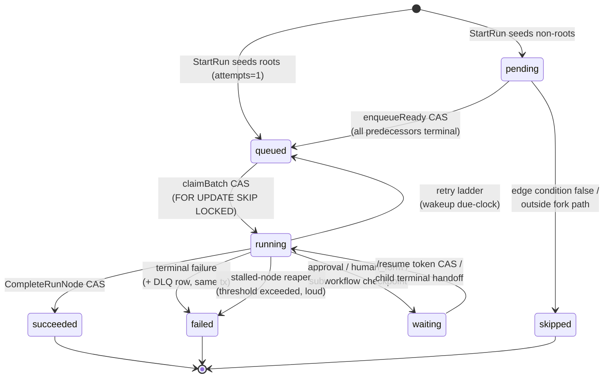
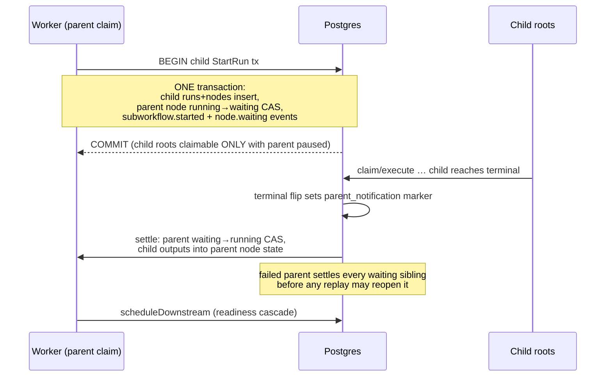
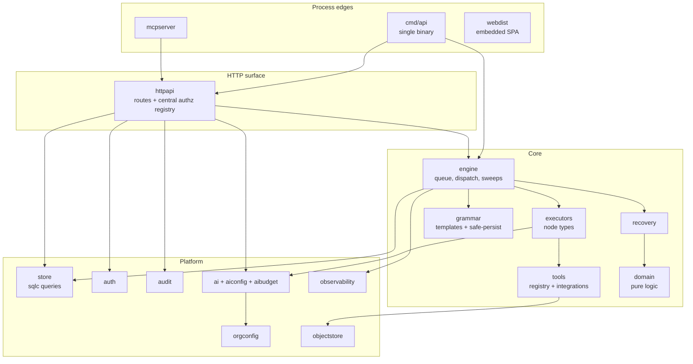
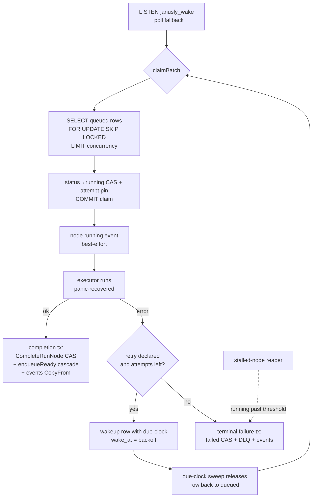

# Janusly Go pilot — architecture

Four load-bearing diagrams plus the one-page ADRs behind the pilot's
non-obvious decisions. Everything here is descriptive of code that ships;
invariants live next to their modules and in [`PLAN.md`](PLAN.md).

## 1. Run/node lifecycle (CAS points + reaper)

The queue IS Postgres: `run_nodes.status` transitions are compare-and-swap
UPDATEs, and every consumer races through the same claim ladder. The reaper
is the crash-recovery path for claims whose worker died.

CAS points worth naming: the queue claim (`LockClaimableRunNodes` …
`FOR UPDATE SKIP LOCKED`), node completion (`CompleteRunNode … WHERE
status='running'`), the terminal run flip (`MarkRunTerminalFromRunning`),
and the resume path (only a still-`waiting` node completes — replays can
never double-write). All timeline events of one completion-family
transaction land in ONE CopyFrom (T-509).

## 2. Subworkflow sequence (atomic checkpoint + handoff)

The `system:subworkflow-terminal-reconciler` sweep retries crash windows
with exact marker acknowledgement — the handoff is at-least-once with a
CAS-idempotent apply.

## 3. Module map (`internal/*`, allowed dependencies)

Rules the arrows encode: `domain` and `grammar` import no I/O packages;
`store` is generated and imports nothing of ours; nothing imports
`httpapi` back; `engine` never imports `httpapi`; every jsonb write goes
through `grammar`'s safe-persist chokepoint.

## 4. Claim ladder + due-clock

The due-clock is a `wakeups` row consumed transactionally: a retry that
fires deletes its wakeup in the SAME completion transaction, so a crashed
worker can never double-arm a retry.

## ADRs (one page each)

### ADR-1 · Due-clock over BullMQ

The reference delays retries/timers through BullMQ delayed jobs (Redis).
The pilot keeps ONE durable system of record: a `wakeups` table with
`wake_at`, swept by the same claim loop. Consequences: no Redis in the
hot path, crash-consistency for free (the wakeup row commits with the
transition that armed it), and the trade-off that wake precision is
bounded by the sweep interval — acceptable because retries are
backoff-scale (seconds), not SLA-scale (milliseconds). LISTEN/NOTIFY
(T-506) closes the latency gap for the common non-delayed path.

### ADR-2 · Zoned-window biases stay split

`time.window` THROWS on malformed config while the PagerDuty policy
evaluator absorbs the same malformation as "working hours". Deliberately
NOT unified: a decision primitive must not answer from bad input, while
a paging policy must never let broken config authorize a mutation. Same
shared zone/midnight-crossing matcher underneath; each caller owns its
failure posture. (Ported from the reference; the bias is the contract.)

### ADR-3 · Orphan-tolerant persistence

No FK constraints. A `workflow_versions` snapshot referencing a deleted
workflow must remain inspectable/replayable; runs, audit rows, and dead
letters outlive their parents on purpose. Deletes are soft (tombstones)
with the hard cascade deferred to the retention sweep. New repos default
to orphan-tolerant; cascade only when child rows are operationally
meaningless without the parent.

### ADR-4 · Sweeps over queues for system work

Retention, reapers, reconcilers, auto-healing, and consent purges are
periodic sweeps under `boot.Runner` (panic-restart with backoff), not
queue consumers. Rationale: system work is idempotent-by-scan (each pass
re-derives its work list from durable state), so a missed tick costs
latency, never correctness — and there is no second broker to operate.
The trade-off (duty-cycle latency) is tuned per sweep via env.

### ADR-5 · The T-500 series: verification before construction

Wave 7 institutionalized census-first: several tickets (T-500, T-506,
T-518) turned out already-implemented or mostly-implemented, and the
ticket became verification + evidence instead of code. The failure mode
it prevents is real (T-526 clobbered a file a stale spec said to create;
T-515 added a config knob the parity tests rejected). Rule of thumb: list
the package and grep the reference BEFORE writing anything.

## Reading order for new contributors

1. [`PLAN.md`](PLAN.md) §18 — what shipped, with evidence per ticket.
2. This file's diagrams 1 + 4 — the queue is the system.
3. `internal/engine/{start,worker,complete,downstream}.go` — the spine.
4. `internal/httpapi/registry.go` — every route and its gate, one table.
